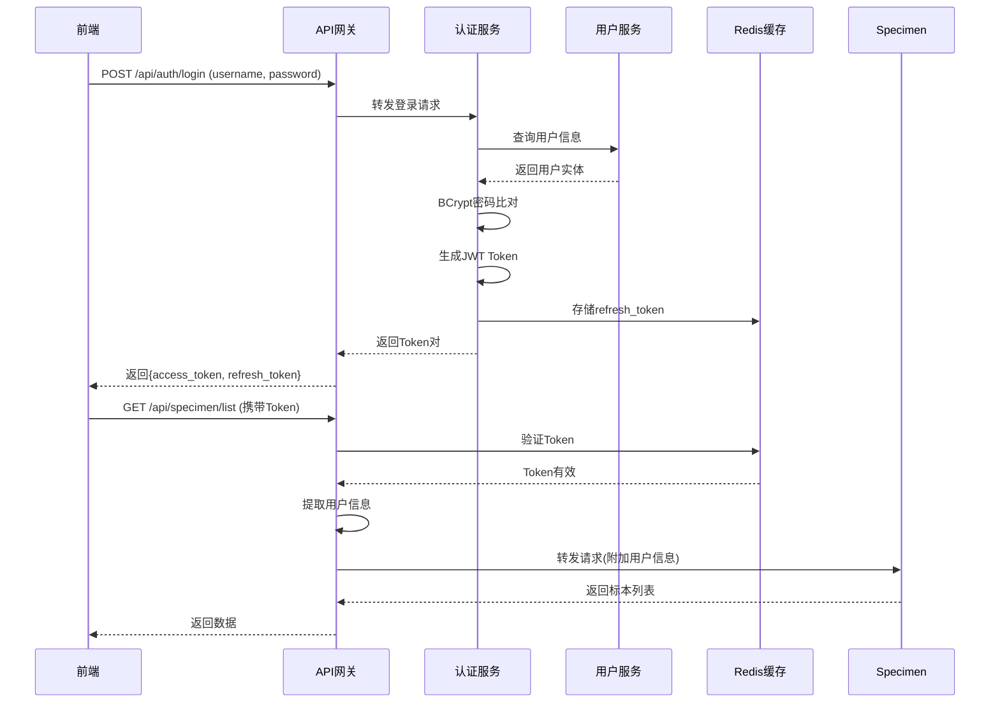
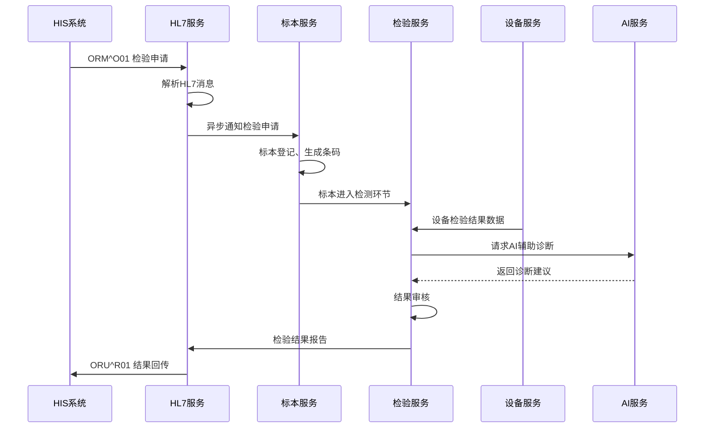

# 基于微服务架构的实验室管理系统 (LIS) - Code Wiki

## 1. 项目概览

基于微服务架构的实验室管理系统（LIS）是一个现代化的医疗实验室信息管理解决方案，旨在实现实验室标本从采集、接收、检测到报告出具的全流程数字化管理。

### 1.1 核心功能

- **用户管理**：基于RBAC模型的用户、角色、权限管理
- **标本管理**：标本全生命周期管理，包括登记、采集、签收、检测状态追踪
- **检验管理**：检验申请、结果录入、审核、报告生成与发布
- **设备管理**：设备台账管理与联机通讯，自动数据采集
- **HL7接口**：与医院HIS系统的标准HL7协议对接
- **数据统计**：多维度业务数据统计与分析
- **AI辅助诊断**：基于规则引擎的检验结果异常分析与辅助审核

### 1.2 技术栈

| 分类 | 技术 | 版本 | 用途 |
|------|------|------|------|
| 后端 | Java | JDK 17 | 后端开发语言 |
|      | Spring Boot | 2.7.x | 微服务基础框架 |
|      | Spring Cloud Alibaba | 2021.x | 微服务治理套件 |
|      | MySQL | 8.0 | 关系型数据库 |
|      | Redis | 6.x | 分布式缓存 |
|      | RabbitMQ | 3.10.x | 消息队列 |
|      | JWT | 0.11.x | 身份认证 |
| 前端 | Vue.js | 3.3.x | 前端框架 |
|      | Element Plus | 2.3.x | UI组件库 |
|      | Pinia | 2.1.x | 状态管理 |
|      | ECharts | 5.4.x | 数据可视化 |
| 部署 | Docker | 20.x | 容器化部署 |
|      | Nginx | - | 静态资源托管与反向代理 |

## 2. 系统架构

### 2.1 架构总览

系统采用分层微服务架构，整体分为基础设施层、数据存储层、微服务层、API网关层和前端展示层五个层次。

```mermaid
graph TB
    subgraph 前端展示层
        A[Vue.js 3 + Element Plus<br/>单页应用 SPA]
    end

    subgraph API网关层
        GW[lis-gateway :8080<br/>Spring Cloud Gateway<br/>路由转发 / 限流 / 鉴权]
    end

    subgraph 微服务层
        S1[lis-auth :8081<br/>认证服务]
        S2[lis-user :8082<br/>用户服务]
        S3[lis-specimen :8083<br/>标本服务]
        S4[lis-report :8084<br/>检验服务]
        S5[lis-equipment :8085<br/>设备服务]
        S6[lis-hl7 :8086<br/>HL7服务]
        S7[lis-statistics :8087<br/>统计服务]
        S8[lis-ai :8088<br/>AI服务]
    end

    subgraph 公共模块
        CM[lis-common<br/>工具类 / 公共实体 / 异常处理]
    end

    subgraph 服务治理
        NC[Nacos<br/>注册中心 + 配置中心]
        SC[Sentinel<br/>熔断降级]
        ST[Seata<br/>分布式事务]
    end

    subgraph 数据存储层
        DB1[(lis_user_db)]
        DB2[(lis_specimen_db)]
        DB3[(lis_report_db)]
        DB4[(lis_equipment_db)]
        DB5[(lis_hl7_db)]
        DB6[(lis_statistics_db)]
        RD[(Redis<br/>缓存 / 会话)]
        MQ[RabbitMQ<br/>消息队列]
    end

    subgraph 基础设施层
        DK[Docker<br/>容器化部署]
        ES[ELK<br/>日志收集]
        PM[Prometheus + Grafana<br/>监控告警]
    end

    A -->|HTTP/HTTPS| GW
    GW --> S1
    GW --> S2
    GW --> S3
    GW --> S4
    GW --> S5
    GW --> S6
    GW --> S7
    GW --> S8

    S1 -.-> NC
    S2 -.-> NC
    S3 -.-> NC
    S4 -.-> NC
    S5 -.-> NC
    S6 -.-> NC
    S7 -.-> NC
    S8 -.-> NC

    S1 -.-> SC
    S2 -.-> SC
    S3 -.-> SC
    S4 -.-> SC
    S5 -.-> SC
    S6 -.-> SC
    S7 -.-> SC
    S8 -.-> SC

    S3 -.-> ST
    S4 -.-> ST

    S1 --> CM
    S2 --> CM
    S3 --> CM
    S4 --> CM
    S5 --> CM
    S6 --> CM
    S7 --> CM
    S8 --> CM

    S2 --> DB1
    S3 --> DB2
    S4 --> DB3
    S5 --> DB4
    S6 --> DB5
    S7 --> DB6

    S1 --> RD
    S2 --> RD
    S3 --> RD
    S4 --> RD

    S3 --> MQ
    S4 --> MQ
    S6 --> MQ

    S1 -.-> ES
    S2 -.-> ES
    S3 -.-> ES
    S4 -.-> ES
    S5 -.-> ES
    S6 -.-> ES
    S7 -.-> ES
    S8 -.-> ES

    S1 -.-> PM
    S2 -.-> PM
    S3 -.-> PM
    S4 -.-> PM
    S5 -.-> PM
    S6 -.-> PM
    S7 -.-> PM
    S8 -.-> PM
```



### 2.2 模块职责

| 服务名称 | 端口 | 职责描述 |
|---------|------|---------|
| lis-gateway | 8080 | API网关，负责路由转发、限流、鉴权 |
| lis-auth | 8081 | 认证服务，负责用户登录认证、Token管理 |
| lis-user | 8082 | 用户服务，负责用户、角色、权限、部门管理 |
| lis-specimen | 8083 | 标本服务，负责标本全生命周期管理 |
| lis-report | 8084 | 检验服务，负责检验报告管理、危急值处理 |
| lis-equipment | 8085 | 设备服务，负责设备联机通讯与数据采集 |
| lis-hl7 | 8086 | HL7服务，负责与HIS系统的HL7消息交互 |
| lis-statistics | 8087 | 统计服务，负责多维度数据统计与报表 |
| lis-ai | 8088 | AI服务，负责规则引擎与辅助诊断 |
| lis-common | - | 公共模块，提供工具类、公共实体等 |

### 2.3 核心流程

#### 2.3.1 认证流程



#### 2.3.2 标本全流程



## 3. 核心模块

### 3.1 认证模块 (lis-auth)

#### 3.1.1 功能特性
- JWT双Token认证机制（access_token + refresh_token）
- 密码BCrypt加密存储
- Token自动刷新
- 基于Redis的Token管理与注销

#### 3.1.2 关键接口

| 接口 | 方法 | 路径 | 说明 |
|------|------|------|------|
| 用户登录 | POST | /api/auth/login | 用户名密码登录，返回Token |
| 令牌刷新 | POST | /api/auth/refresh | 刷新Access Token |
| 用户登出 | POST | /api/auth/logout | 注销当前Token |

### 3.2 用户模块 (lis-user)

#### 3.2.1 功能特性
- 基于RBAC的权限控制
- 用户、角色、权限、部门管理
- 数据字典管理
- 操作日志审计

#### 3.2.2 关键接口

| 接口 | 方法 | 路径 | 说明 |
|------|------|------|------|
| 用户列表 | GET | /api/user/page | 分页查询用户列表 |
| 新增用户 | POST | /api/user | 新增用户 |
| 修改用户 | PUT | /api/user/{id} | 修改用户信息 |
| 删除用户 | DELETE | /api/user/{id} | 删除用户 |
| 重置密码 | PUT | /api/user/{id}/password | 重置用户密码 |
| 角色列表 | GET | /api/role/list | 查询所有角色 |
| 分配角色 | PUT | /api/user/{id}/roles | 为用户分配角色 |

### 3.3 标本模块 (lis-specimen)

#### 3.3.1 功能特性
- 标本全生命周期管理
- 标本条码生成与管理
- 标本状态机流转
- 标本质量检查
- 标本全流程追溯

#### 3.3.2 关键接口

| 接口 | 方法 | 路径 | 说明 |
|------|------|------|------|
| 标本列表 | GET | /api/specimen/page | 分页查询标本列表 |
| 标本详情 | GET | /api/specimen/{id} | 查询标本详情 |
| 标本接收 | PUT | /api/specimen/{id}/receive | 标本签收 |
| 标本拒收 | PUT | /api/specimen/{id}/reject | 标本拒收 |
| 条码打印 | GET | /api/specimen/{id}/barcode | 获取条码打印数据 |

### 3.4 检验模块 (lis-report)

#### 3.4.1 功能特性
- 检验申请管理
- 检验结果录入（手工/自动）
- 三级审核机制
- 危急值判断与通知
- 检验报告生成与发布

#### 3.4.2 关键接口

| 接口 | 方法 | 路径 | 说明 |
|------|------|------|------|
| 申请列表 | GET | /api/report/application/page | 分页查询检验申请 |
| 创建申请 | POST | /api/report/application | 创建检验申请 |
| 结果录入 | POST | /api/report/result | 录入检验结果 |
| 结果审核 | PUT | /api/report/{id}/audit | 审核检验结果 |
| 报告查询 | GET | /api/report/{id} | 查询检验报告 |
| 报告打印 | GET | /api/report/{id}/print | 获取报告打印数据 |

### 3.5 设备模块 (lis-equipment)

#### 3.5.1 功能特性
- 设备台账管理
- 设备状态监控
- 联机通讯（串口/TCP）
- 设备数据采集与解析
- 设备维护与校准管理

### 3.6 HL7模块 (lis-hl7)

#### 3.6.1 功能特性
- HL7 V2.5.1消息解析与构建
- MLLP协议通讯
- 与HIS系统集成
- 消息路由与处理
- 消息日志记录

### 3.7 统计模块 (lis-statistics)

#### 3.7.1 功能特性
- 标本统计
- 检验统计
- 设备统计
- 人员统计
- 收入统计
- 报表导出

### 3.8 AI模块 (lis-ai)

#### 3.8.1 功能特性
- 规则引擎设计
- 检验结果异常分析
- 辅助审核建议
- 参考范围预测
- 趋势分析

## 4. 关键类与函数

### 4.1 认证模块

#### 4.1.1 JwtTokenUtil
- **功能**：JWT Token生成与验证
- **核心方法**：
  - `generateAccessToken(user, roles, permissions)`: 生成访问令牌
  - `generateRefreshToken(user)`: 生成刷新令牌
  - `validateToken(token)`: 验证令牌有效性
  - `parseToken(token)`: 解析令牌获取用户信息

#### 4.1.2 AuthService
- **功能**：认证业务逻辑
- **核心方法**：
  - `login(username, password)`: 用户登录
  - `refreshToken(refreshToken)`: 刷新令牌
  - `logout(userId)`: 用户登出

### 4.2 用户模块

#### 4.2.1 UserService
- **功能**：用户管理业务逻辑
- **核心方法**：
  - `createUser(userDTO)`: 创建用户
  - `updateUser(userId, userDTO)`: 更新用户
  - `deleteUser(userId)`: 删除用户
  - `loadUserPermissions(userId)`: 加载用户权限

#### 4.2.2 RoleService
- **功能**：角色管理业务逻辑
- **核心方法**：
  - `createRole(roleDTO)`: 创建角色
  - `assignPermissions(roleId, permissionIds)`: 为角色分配权限
  - `getRolesByUserId(userId)`: 获取用户角色

### 4.3 标本模块

#### 4.3.1 SpecimenService
- **功能**：标本管理业务逻辑
- **核心方法**：
  - `registerSpecimen(specimenDTO)`: 登记标本
  - `batchReceive(barcodeList, operatorId)`: 批量签收标本
  - `changeStatus(specimenId, targetStatus, operatorId)`: 变更标本状态
  - `getSpecimenTrace(specimenId)`: 获取标本追溯记录

#### 4.3.2 SpecimenStatusManager
- **功能**：标本状态机管理
- **核心方法**：
  - `validateTransition(currentStatus, targetStatus)`: 验证状态转移合法性
  - `getStatusName(status)`: 获取状态名称

### 4.4 检验模块

#### 4.4.1 ReportService
- **功能**：检验报告管理业务逻辑
- **核心方法**：
  - `createTestOrder(orderDTO)`: 创建检验申请
  - `manualInputResult(reportId, resultDTOs)`: 手工录入结果
  - `auditReport(reportId, auditAction, auditorId, comment)`: 审核报告
  - `checkCriticalValue(itemCode, resultValue)`: 检查危急值

#### 4.4.2 ResultAnalyzer
- **功能**：检验结果分析
- **核心方法**：
  - `judgeAbnormal(referenceRange, resultValue)`: 判断结果是否异常
  - `importFromEquipment(equipmentId, rawData)`: 导入设备数据

### 4.5 设备模块

#### 4.5.1 EquipmentService
- **功能**：设备管理业务逻辑
- **核心方法**：
  - `connectEquipment(equipmentId)`: 连接设备
  - `parseResultData(equipmentId, rawData)`: 解析设备数据
  - `monitorEquipmentStatus()`: 监控设备状态

### 4.6 HL7模块

#### 4.6.1 HL7Service
- **功能**：HL7消息处理
- **核心方法**：
  - `parseHL7Message(rawMessage)`: 解析HL7消息
  - `buildORUMessage(report)`: 构建ORU结果消息
  - `sendORMAck(reportNo, status)`: 发送ORM确认消息
  - `handleADTMessage(message)`: 处理ADT患者消息

### 4.7 统计模块

#### 4.7.1 StatisticsService
- **功能**：统计业务逻辑
- **核心方法**：
  - `getSpecimenStatistics(params)`: 获取标本统计数据
  - `getReportStatistics(params)`: 获取检验统计数据
  - `getEquipmentStatistics(params)`: 获取设备统计数据
  - `generateDailyReport(date)`: 生成日报表

### 4.8 AI模块

#### 4.8.1 AIService
- **功能**：AI辅助诊断
- **核心方法**：
  - `analyzeResult(reportId)`: 分析检验结果
  - `predictReferenceRange(patientInfo, itemCode)`: 预测参考范围
  - `detectAnomaly(patientId, itemCode, historyData)`: 检测异常模式
  - `generateDiagnosis(reportId)`: 生成诊断建议

## 5. 数据库设计

### 5.1 数据库概览

系统采用分库策略，每个微服务拥有独立的数据库实例：

| 数据库名 | 所属服务 | 主要用途 |
|---------|---------|---------|
| lis_user_db | lis-user | 用户、角色、权限管理 |
| lis_specimen_db | lis-specimen | 标本管理 |
| lis_report_db | lis-report | 检验报告管理 |
| lis_equipment_db | lis-equipment | 设备管理 |
| lis_hl7_db | lis-hl7 | HL7消息管理 |
| lis_statistics_db | lis-statistics | 统计数据管理 |

### 5.2 核心数据表

#### 5.2.1 用户数据库 (lis_user_db)

| 表名 | 主要字段 | 说明 |
|------|---------|------|
| sys_user | id, username, password, real_name, phone, email, dept_id, status | 系统用户表 |
| sys_role | id, role_name, role_code, description, status | 系统角色表 |
| sys_menu | id, menu_name, path, component, permission, icon, sort, menu_type, parent_id | 系统菜单表 |
| sys_user_role | user_id, role_id | 用户角色关联表 |
| sys_role_menu | role_id, menu_id | 角色菜单关联表 |
| sys_department | id, dept_name, parent_id, sort_order, status | 部门表 |

#### 5.2.2 标本数据库 (lis_specimen_db)

| 表名 | 主要字段 | 说明 |
|------|---------|------|
| lis_patient | id, patient_no, name, gender, birthday, id_card, phone | 患者信息表 |
| lis_specimen | id, specimen_no, barcode, patient_id, dept_id, collector_id, specimen_type, status, collect_time, receive_time | 标本信息表 |
| specimen_trace | id, specimen_id, operator_id, action, remark, create_time | 标本追溯表 |

#### 5.2.3 检验数据库 (lis_report_db)

| 表名 | 主要字段 | 说明 |
|------|---------|------|
| lis_test_item | id, item_code, item_name, category, unit, reference_range | 检验项目表 |
| lis_test_profile | id, profile_code, profile_name, category | 检验组合表 |
| lis_application | id, application_no, patient_id, specimen_id, profile_id, status, request_doctor, request_time | 检验申请表 |
| lis_report | id, report_no, specimen_id, patient_id, application_id, auditor_id, report_status, audit_time | 检验报告表 |
| lis_report_item | id, report_id, test_item_id, equipment_id, result_value, result_status, abnormal_flag, reference_range | 报告明细表 |
| lis_critical_value | id, report_item_id, reporter_id, notifier_id, patient_id, notify_time, handle_status | 危急值记录表 |

## 6. 运行与部署

### 6.1 启动顺序

```
阶段1 - 基础设施启动：
  MySQL 8.0（各实例） → Redis 7.x → RabbitMQ → Nacos Server

阶段2 - 微服务启动（无严格顺序，可并行）：
  lis-common（编译依赖，非运行时服务）
  lis-auth → lis-user → lis-specimen → lis-report → lis-equipment
  → lis-hl7 → lis-statistics → lis-ai

阶段3 - 网关启动：
  lis-gateway（依赖所有业务服务注册至Nacos后启动）

阶段4 - 前端启动：
  Nginx（托管Vue.js 3编译产物）
```

### 6.2 环境配置

系统配置分为三个层级：
- **Bootstrap配置**：各服务的Nacos连接地址等基础配置，存储在各服务的bootstrap.yml中
- **应用配置**：各微服务的业务配置，存储在Nacos配置中心，支持动态刷新
- **环境配置**：通过Nacos的Namespace机制区分开发（dev）、测试（test）、生产（prod）环境

### 6.3 容器化部署

系统采用Docker容器化部署，使用Docker Compose编排服务依赖关系：

```yaml
# docker-compose.yml 示例
services:
  nacos:
    image: nacos/nacos-server:v2.3.0
    ports:
      - "8848:8848"
    environment:
      - MODE=standalone

  mysql:
    image: mysql:8.0
    ports:
      - "3306:3306"
    environment:
      - MYSQL_ROOT_PASSWORD=root
    volumes:
      - ./mysql-data:/var/lib/mysql

  redis:
    image: redis:6
    ports:
      - "6379:6379"

  rabbitmq:
    image: rabbitmq:3.10-management
    ports:
      - "5672:5672"
      - "15672:15672"

  # 微服务容器配置...
```

### 6.4 监控与日志

- **日志收集**：使用ELK（Elasticsearch + Logstash + Kibana）进行集中式日志管理
- **监控告警**：使用Prometheus + Grafana监控系统指标，设置告警规则
- **健康检查**：各微服务提供健康检查端点，集成到监控系统

## 7. 开发与测试

### 7.1 开发规范

- **代码规范**：遵循Java编码规范，使用Lombok简化代码
- **Git规范**：遵循Git Flow工作流，提交信息使用Conventional Commits格式
- **接口规范**：所有API遵循RESTful设计风格，统一响应格式
- **命名规范**：包名、类名、方法名等遵循Java命名规范

### 7.2 测试策略

- **单元测试**：使用JUnit 5 + Mockito进行单元测试
- **集成测试**：使用Testcontainers进行容器化集成测试
- **API测试**：使用Postman进行API接口测试
- **性能测试**：使用JMeter进行性能测试

### 7.3 开发工具

- **后端**：IntelliJ IDEA, Maven
- **前端**：VS Code, npm/pnpm
- **数据库**：Navicat, MySQL Workbench
- **API测试**：Postman
- **版本控制**：Git

## 8. 常见问题与解决方案

### 8.1 认证问题

| 问题 | 原因 | 解决方案 |
|------|------|---------|
| Token过期 | access_token有效期为2小时 | 前端实现Token自动刷新机制 |
| Token无效 | Token被篡改或已注销 | 重新登录获取新Token |
| 权限不足 | 用户无对应操作权限 | 联系管理员分配权限 |

### 8.2 标本管理问题

| 问题 | 原因 | 解决方案 |
|------|------|---------|
| 标本条码重复 | 条码生成算法问题 | 检查Redis自增键是否正确 |
| 标本状态无法变更 | 状态转移不合法 | 检查状态机配置和当前状态 |
| 标本质量不合格 | 采集时间过长或容器问题 | 严格按照采集规范操作 |

### 8.3 检验管理问题

| 问题 | 原因 | 解决方案 |
|------|------|---------|
| 危急值通知失败 | 通知配置问题 | 检查通知渠道配置和接收人设置 |
| 报告审核无法通过 | 存在未录入结果的项目 | 确保所有检验项目都已录入结果 |
| 设备数据导入失败 | 数据格式不匹配 | 检查设备协议配置和数据解析规则 |

### 8.4 系统运维问题

| 问题 | 原因 | 解决方案 |
|------|------|---------|
| 服务启动失败 | 依赖服务未就绪 | 检查启动顺序和依赖服务状态 |
| 数据库连接失败 | 连接配置错误 | 检查数据库地址、端口和凭据 |
| 内存使用过高 | JVM参数配置不当 | 调整JVM堆内存大小和GC策略 |

## 9. 总结与亮点

### 9.1 系统亮点

1. **微服务架构**：采用Spring Cloud Alibaba微服务技术栈，实现服务的独立部署、扩展和管理
2. **全流程管理**：实现标本从采集到报告的全流程数字化管理，提高实验室工作效率
3. **标准化集成**：支持HL7 V2.5.1标准协议，实现与HIS系统的无缝集成
4. **AI辅助诊断**：引入规则引擎和AI技术，提升检验结果的审核效率和准确性
5. **安全可靠**：采用JWT认证、BCrypt密码加密、细粒度权限控制等安全措施
6. **容器化部署**：使用Docker和Docker Compose实现快速部署和环境一致性
7. **完善的监控**：集成ELK和Prometheus，实现系统监控和日志管理

### 9.2 应用价值

- **提高工作效率**：自动化流程减少人工操作，提高实验室工作效率
- **保证数据质量**：标准化的数据采集和处理流程，确保检验结果的准确性
- **提升管理水平**：多维度的数据统计和分析，辅助实验室管理决策
- **加强医疗安全**：危急值实时通知，确保患者安全
- **促进信息共享**：与HIS系统的集成，实现医疗信息的互联互通

### 9.3 未来展望

1. **AI能力增强**：引入机器学习模型，提升辅助诊断的准确性和智能化水平
2. **移动应用**：开发移动端应用，支持标本采集、结果查询等移动化操作
3. **区块链集成**：利用区块链技术确保检验数据的不可篡改和可追溯性
4. **云原生部署**：探索云原生部署方案，提高系统的弹性和可扩展性
5. **智能设备集成**：支持更多类型的检验设备，实现更广泛的设备互联

---

本Code Wiki文档提供了基于微服务架构的实验室管理系统的全面技术参考，涵盖了系统架构、核心模块、关键类与函数、数据库设计、运行部署等各个方面。系统采用现代化的技术栈和架构设计，为实验室提供了高效、安全、可靠的信息管理解决方案。