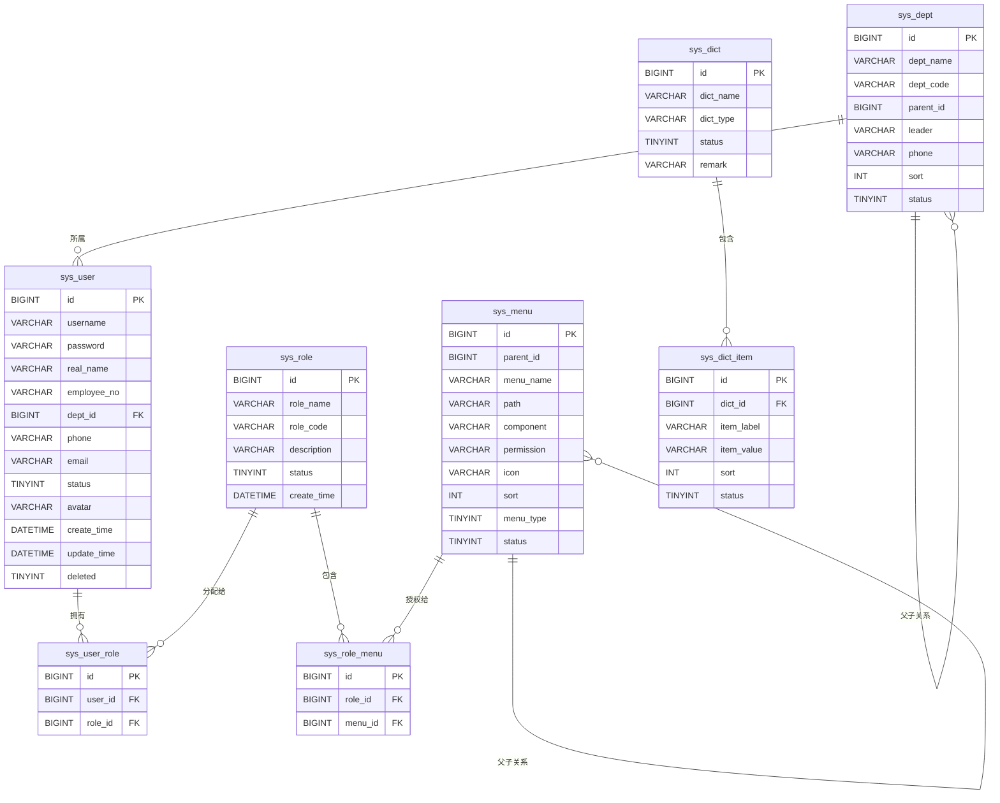
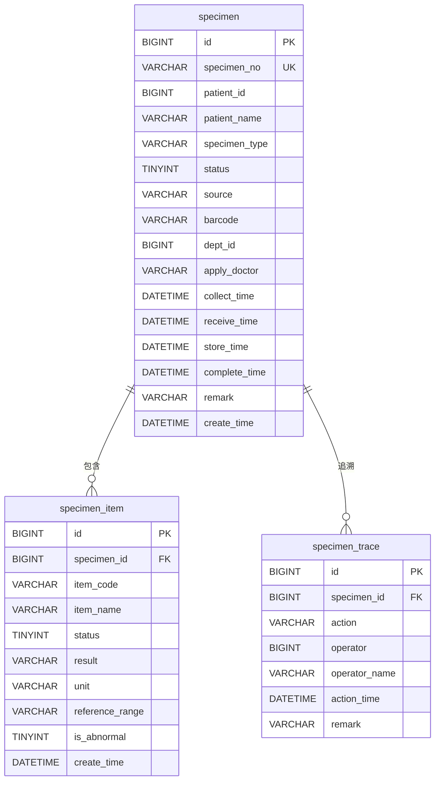
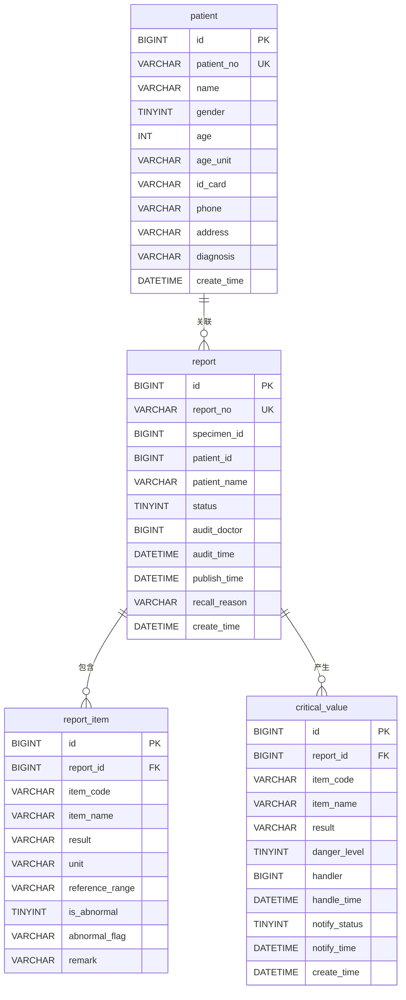
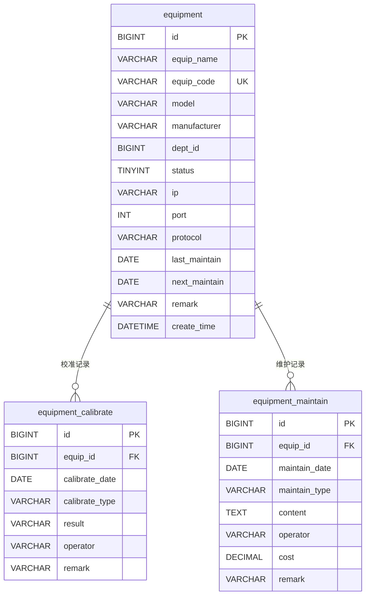
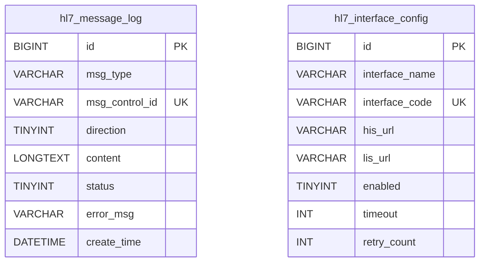
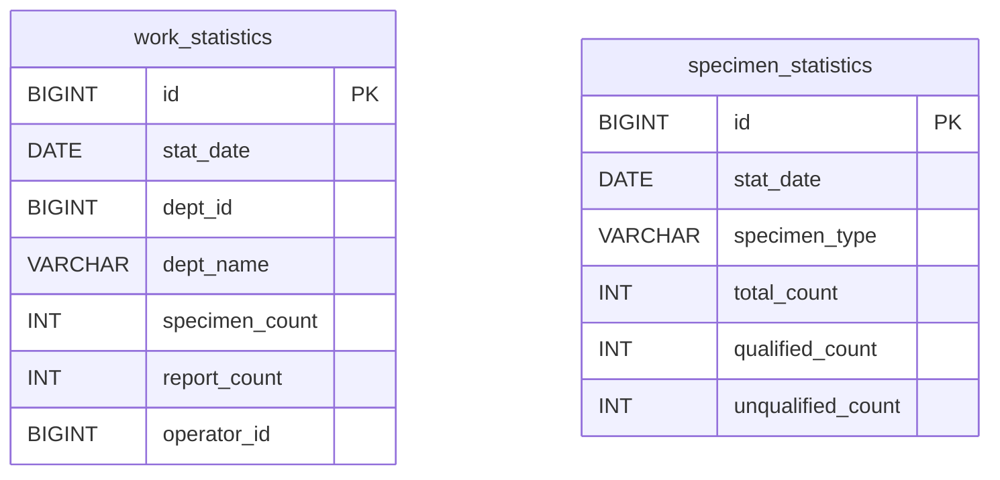
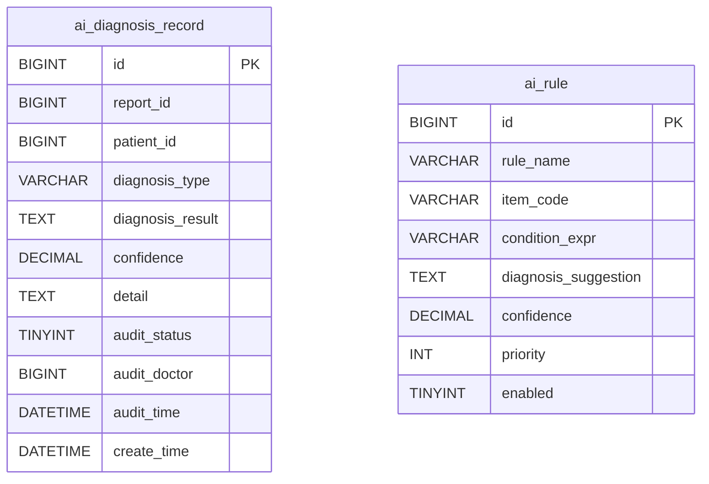
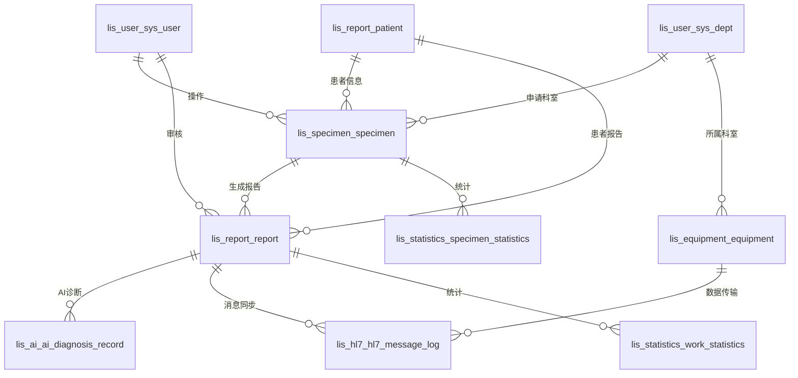

# 数据库设计说明书

| 文档信息 | 内容 |
|---------|------|
| 项目名称 | 基于微服务架构的实验室管理系统设计与实现 |
| 文档版本 | V1.0 |
| 编写日期 | 2026年4月 |
| 数据库版本 | MySQL 8.0 |
| 文档状态 | 正式发布 |

---

## 目录

- [1 引言](#1-引言)
  - [1.1 编写目的](#11-编写目的)
  - [1.2 项目背景](#12-项目背景)
  - [1.3 适用范围](#13-适用范围)
  - [1.4 术语与缩写](#14-术语与缩写)
  - [1.5 参考文档](#15-参考文档)
- [2 数据库总体设计](#2-数据库总体设计)
  - [2.1 设计原则](#21-设计原则)
  - [2.2 命名规范](#22-命名规范)
  - [2.3 分库策略](#23-分库策略)
  - [2.4 数据库总体架构](#24-数据库总体架构)
- [3 数据库表结构设计](#3-数据库表结构设计)
  - [3.1 用户服务数据库（lis_user）](#31-用户服务数据库lis_user)
  - [3.2 标本服务数据库（lis_specimen）](#32-标本服务数据库lis_specimen)
  - [3.3 检验服务数据库（lis_report）](#33-检验服务数据库lis_report)
  - [3.4 设备服务数据库（lis_equipment）](#34-设备服务数据库lis_equipment)
  - [3.5 HL7服务数据库（lis_hl7）](#35-hl7服务数据库lis_hl7)
  - [3.6 统计服务数据库（lis_statistics）](#36-统计服务数据库lis_statistics)
  - [3.7 AI服务数据库（lis_ai）](#37-ai服务数据库lis_ai)
- [4 E-R图设计](#4-e-r图设计)
  - [4.1 用户服务E-R图](#41-用户服务e-r图)
  - [4.2 标本服务E-R图](#42-标本服务e-r图)
  - [4.3 检验服务E-R图](#43-检验服务e-r图)
  - [4.4 设备服务E-R图](#44-设备服务e-r图)
  - [4.5 HL7服务E-R图](#45-hl7服务e-r图)
  - [4.6 统计服务E-R图](#46-统计服务e-r图)
  - [4.7 AI服务E-R图](#47-ai服务e-r图)
  - [4.8 跨服务关联E-R图](#48-跨服务关联e-r图)
- [5 索引设计](#5-索引设计)
  - [5.1 用户服务索引](#51-用户服务索引)
  - [5.2 标本服务索引](#52-标本服务索引)
  - [5.3 检验服务索引](#53-检验服务索引)
  - [5.4 设备服务索引](#54-设备服务索引)
  - [5.5 HL7服务索引](#55-hl7服务索引)
  - [5.6 统计服务索引](#56-统计服务索引)
  - [5.7 AI服务索引](#57-ai服务索引)
- [6 数据字典](#6-数据字典)
  - [6.1 公共字段说明](#61-公共字段说明)
  - [6.2 枚举值定义](#62-枚举值定义)
  - [6.3 状态码汇总](#63-状态码汇总)
- [7 数据安全设计](#7-数据安全设计)
  - [7.1 访问控制](#71-访问控制)
  - [7.2 数据加密](#72-数据加密)
  - [7.3 审计日志](#73-审计日志)
  - [7.4 备份与恢复策略](#74-备份与恢复策略)
  - [7.5 数据脱敏](#75-数据脱敏)

---

## 1 引言

### 1.1 编写目的

本文档是"基于微服务架构的实验室管理系统设计与实现"项目的数据库设计说明书，旨在全面、详细地描述系统中各微服务所涉及的数据库设计内容。本文档将作为数据库开发、测试、部署以及后续运维的重要参考依据，同时也是系统开发团队与数据库管理员（DBA）之间沟通的技术桥梁。

本文档的预期读者包括：

- **系统架构师**：用于评审数据库总体架构设计和分库策略的合理性；
- **后端开发工程师**：用于指导数据库表的创建、实体类的映射以及数据访问层的开发；
- **数据库管理员（DBA）**：用于指导数据库实例的部署、索引优化、备份策略的制定；
- **测试工程师**：用于设计数据库层面的测试用例，验证数据完整性与约束条件；
- **项目评审专家**：用于毕业设计答辩中展示数据库设计的规范性与完整性。

### 1.2 项目背景

实验室信息系统（Laboratory Information System，LIS）是医疗机构信息化建设的核心组成部分，承担着标本管理、检验流程控制、报告生成与审核、设备管理等关键业务功能。随着医疗检验业务量的持续增长和检验项目的不断丰富，传统的单体架构LIS系统已难以满足高并发、高可用、易扩展的需求。

本课题采用微服务架构对实验室管理系统进行重新设计与实现，将系统拆分为用户管理、标本管理、检验管理、设备管理、HL7接口对接、数据统计和AI辅助诊断七大功能模块，每个模块对应独立的微服务，拥有各自的数据库实例，从而实现服务的独立部署、独立扩展和独立演进。

### 1.3 适用范围

本文档适用于本项目的全部数据库设计工作，涵盖以下七个微服务对应的数据库实例：

| 序号 | 服务名称 | 数据库名称 | 说明 |
|------|---------|-----------|------|
| 1 | 用户服务 | lis_user | 用户、角色、权限、部门、字典管理 |
| 2 | 标本服务 | lis_specimen | 标本登记、项目绑定、追溯管理 |
| 3 | 检验服务 | lis_report | 报告管理、患者信息、危急值管理 |
| 4 | 设备服务 | lis_equipment | 设备台账、校准记录、维护记录 |
| 5 | HL7服务 | lis_hl7 | HL7消息日志、接口配置 |
| 6 | 统计服务 | lis_statistics | 工作量统计、标本统计 |
| 7 | AI服务 | lis_ai | AI诊断记录、诊断规则管理 |

### 1.4 术语与缩写

| 术语/缩写 | 全称 | 说明 |
|----------|------|------|
| LIS | Laboratory Information System | 实验室信息系统 |
| HL7 | Health Level Seven | 健康信息交换第七层协议 |
| RBAC | Role-Based Access Control | 基于角色的访问控制 |
| E-R | Entity-Relationship | 实体-关系模型 |
| DDL | Data Definition Language | 数据定义语言 |
| DML | Data Manipulation Language | 数据操作语言 |
| DBA | Database Administrator | 数据库管理员 |
| CRUD | Create, Read, Update, Delete | 增删改查基本操作 |
| BLOB | Binary Large Object | 二进制大对象 |
| DICOM | Digital Imaging and Communications in Medicine | 医学数字成像和通信 |

### 1.5 参考文档

- 《软件需求说明书》
- 《概要设计说明书》
- 《MySQL 8.0 参考手册》
- HL7 v2.4 标准规范
- GB/T 22239-2019 信息安全技术 网络安全等级保护基本要求

---

## 2 数据库总体设计

### 2.1 设计原则

本系统的数据库设计遵循以下核心原则：

**（1）服务独立原则**

每个微服务拥有独立的数据库实例，服务之间的数据访问必须通过API接口进行，禁止跨库直接查询。这一原则保证了各服务的数据独立性，使得单个服务的数据库变更不会影响其他服务，同时也为后续的服务拆分、合并或迁移提供了灵活性。

**（2）高内聚低耦合原则**

将业务关联紧密的数据放在同一个数据库中，减少分布式事务的发生频率。例如，用户、角色、权限、菜单等权限管理相关的数据统一放在 `lis_user` 数据库中；标本及其检验项目、追溯记录统一放在 `lis_specimen` 数据库中。

**（3）数据一致性原则**

在微服务架构下，跨服务的数据一致性通过最终一致性方案保证。系统采用事件驱动机制，当某个服务的数据发生变更时，通过消息队列（如RabbitMQ）通知相关服务进行数据同步，避免使用分布式事务带来的性能损耗。

**（4）可扩展性原则**

表设计预留足够的扩展字段，采用合理的字段类型和长度。对于可能增长较快的数据表（如消息日志表、统计表），采用按时间分表或分区策略，确保系统在数据量增长时仍能保持良好的查询性能。

**（5）安全性原则**

敏感数据（如用户密码、患者身份证号等）必须加密存储。所有数据库访问均通过连接池管理，应用层使用预编译语句防止SQL注入。数据库层面实施最小权限原则，每个微服务仅拥有其对应数据库的访问权限。

**（6）规范化与反规范化平衡原则**

核心业务表遵循第三范式（3NF）设计，消除数据冗余和更新异常。但在统计类表和需要频繁关联查询的场景中，适当引入冗余字段（如统计表中的部门名称），以空间换时间，提升查询效率。

### 2.2 命名规范

为保证数据库对象名称的一致性和可读性，本系统制定以下命名规范：

**（1）数据库命名规范**

- 格式：`lis_<服务英文标识>`
- 全部小写，单词间以下划线分隔
- 示例：`lis_user`、`lis_specimen`、`lis_report`

**（2）表命名规范**

- 系统基础表以 `sys_` 为前缀，如 `sys_user`、`sys_role`
- 业务表直接使用业务实体英文名，如 `specimen`、`report`
- 关联表使用 `<主表>_<从表>` 格式，如 `sys_user_role`、`sys_role_menu`
- 日志表以 `_log` 为后缀，如 `hl7_message_log`
- 统计表以 `_statistics` 为后缀，如 `work_statistics`
- 配置表以 `_config` 为后缀，如 `hl7_interface_config`
- 全部小写，单词间以下划线分隔

**（3）字段命名规范**

- 使用蛇形命名法（snake_case），如 `create_time`、`patient_name`
- 主键字段统一命名为 `id`，类型为 `BIGINT`
- 外键字段命名为 `<关联表单数>_id`，如 `user_id`、`role_id`、`specimen_id`
- 布尔类型字段以 `is_` 为前缀，如 `is_abnormal`、`enabled`
- 时间类型字段以 `_time` 或 `_date` 为后缀，如 `create_time`、`collect_time`
- 状态类型字段统一命名为 `status`
- 名称类字段以 `_name` 为后缀，如 `role_name`、`dept_name`
- 编码类字段以 `_code` 或 `_no` 为后缀，如 `role_code`、`specimen_no`

**（4）索引命名规范**

- 主键索引：`PRIMARY`
- 唯一索引：`uk_<表名>_<字段名>`
- 普通索引：`idx_<表名>_<字段名>`
- 组合索引：`idx_<表名>_<字段1>_<字段2>`

### 2.3 分库策略

本系统采用"一服务一库"的分库策略，即每个微服务对应一个独立的MySQL数据库实例（或同一实例下的独立Schema）。分库策略的设计考量如下：

**（1）分库依据**

| 服务 | 数据库 | 分库理由 |
|------|--------|---------|
| 用户服务 | lis_user | 用户与权限数据变更频率低，但访问频率高，独立部署便于缓存策略的制定 |
| 标本服务 | lis_specimen | 标本数据量大、写入频繁，独立部署便于水平扩展 |
| 检验服务 | lis_report | 报告数据涉及审核流程，独立部署保证核心业务的数据一致性 |
| 设备服务 | lis_equipment | 设备数据与检验业务弱耦合，独立管理便于设备数据的维护 |
| HL7服务 | lis_hl7 | 消息日志数据增长快，独立部署便于归档和清理策略的实施 |
| 统计服务 | lis_statistics | 统计数据为聚合计算结果，独立部署便于读写分离和查询优化 |
| AI服务 | lis_ai | AI诊断数据具有特殊性，独立部署便于GPU资源调度和模型迭代 |

**（2）跨服务数据访问方案**

服务之间的数据访问通过以下方式实现：

- **同步调用**：通过RESTful API或gRPC进行实时数据查询，适用于需要即时响应的场景（如报告审核时查询用户信息）。
- **异步事件**：通过消息队列进行数据同步，适用于对实时性要求不高的场景（如标本状态变更后通知统计服务更新统计数据）。
- **数据冗余**：在必要的场景下，允许在目标服务中冗余存储少量关联数据（如标本服务中冗余患者姓名），以减少跨服务调用次数。

**（3）数据一致性保障**

- 核心业务流程（如标本登记-检验-报告审核）采用Saga编排模式保证最终一致性；
- 关键操作（如报告审核、危急值处理）通过补偿事务机制实现回滚；
- 定期执行数据一致性校验任务，发现并修复不一致数据。

### 2.4 数据库总体架构

```
┌─────────────────────────────────────────────────────────────────┐
│                        应用服务层                                │
│  ┌──────────┐ ┌──────────┐ ┌──────────┐ ┌──────────┐           │
│  │ 用户服务  │ │ 标本服务  │ │ 检验服务  │ │ 设备服务  │           │
│  └────┬─────┘ └────┬─────┘ └────┬─────┘ └────┬─────┘           │
│  ┌──────────┐ ┌──────────┐ ┌──────────┐                          │
│  │ HL7服务  │ │ 统计服务  │ │ AI服务   │                          │
│  └────┬─────┘ └────┬─────┘ └────┬─────┘                          │
├───────┴────────────┴────────────┴───────────────────────────────┤
│                        数据库层                                  │
│  ┌──────────┐ ┌──────────┐ ┌──────────┐ ┌──────────┐           │
│  │lis_user  │ │lis_speci-│ │lis_report│ │lis_equi- │           │
│  │          │ │men       │ │          │ │pment     │           │
│  └──────────┘ └──────────┘ └──────────┘ └──────────┘           │
│  ┌──────────┐ ┌──────────┐ ┌──────────┐                          │
│  │lis_hl7   │ │lis_stati-│ │lis_ai    │                          │
│  │          │ │stics     │ │          │                          │
│  └──────────┘ └──────────┘ └──────────┘                          │
└─────────────────────────────────────────────────────────────────┘
```

---

## 3 数据库表结构设计

### 3.1 用户服务数据库（lis_user）

用户服务数据库负责管理系统用户、角色、权限、部门组织结构以及系统字典等基础数据，是整个系统的基础支撑模块。

#### 3.1.1 sys_user（用户表）

用户表存储系统所有用户的基本信息，包括登录账号、密码、个人资料以及所属部门等。

| 字段名 | 数据类型 | 长度 | 主键 | 是否为空 | 默认值 | 说明 |
|--------|---------|------|------|---------|--------|------|
| id | BIGINT | 20 | PK | NOT NULL | - | 用户ID，雪花算法生成 |
| username | VARCHAR | 50 | - | NOT NULL | - | 登录用户名，唯一 |
| password | VARCHAR | 128 | - | NOT NULL | - | 登录密码，BCrypt加密存储 |
| real_name | VARCHAR | 50 | - | NOT NULL | - | 真实姓名 |
| employee_no | VARCHAR | 30 | - | NULL | NULL | 工号 |
| dept_id | BIGINT | 20 | - | NULL | NULL | 所属部门ID |
| phone | VARCHAR | 20 | - | NULL | NULL | 手机号码 |
| email | VARCHAR | 100 | - | NULL | NULL | 电子邮箱 |
| status | TINYINT | 4 | - | NOT NULL | 1 | 状态：0-禁用，1-正常 |
| avatar | VARCHAR | 255 | - | NULL | NULL | 头像URL |
| create_time | DATETIME | - | - | NOT NULL | CURRENT_TIMESTAMP | 创建时间 |
| update_time | DATETIME | - | - | NOT NULL | CURRENT_TIMESTAMP ON UPDATE CURRENT_TIMESTAMP | 更新时间 |
| deleted | TINYINT | 1 | - | NOT NULL | 0 | 逻辑删除：0-未删除，1-已删除 |

#### 3.1.2 sys_role（角色表）

角色表定义系统中的各类角色，如系统管理员、检验医生、审核医生、标本采集员等。

| 字段名 | 数据类型 | 长度 | 主键 | 是否为空 | 默认值 | 说明 |
|--------|---------|------|------|---------|--------|------|
| id | BIGINT | 20 | PK | NOT NULL | - | 角色ID |
| role_name | VARCHAR | 50 | - | NOT NULL | - | 角色名称 |
| role_code | VARCHAR | 50 | - | NOT NULL | - | 角色编码，唯一 |
| description | VARCHAR | 200 | - | NULL | NULL | 角色描述 |
| status | TINYINT | 4 | - | NOT NULL | 1 | 状态：0-禁用，1-正常 |
| create_time | DATETIME | - | - | NOT NULL | CURRENT_TIMESTAMP | 创建时间 |

#### 3.1.3 sys_menu（菜单表）

菜单表定义系统的菜单结构和权限标识，采用树形结构设计，支持多级菜单。

| 字段名 | 数据类型 | 长度 | 主键 | 是否为空 | 默认值 | 说明 |
|--------|---------|------|------|---------|--------|------|
| id | BIGINT | 20 | PK | NOT NULL | - | 菜单ID |
| parent_id | BIGINT | 20 | - | NOT NULL | 0 | 父菜单ID，0表示顶级菜单 |
| menu_name | VARCHAR | 50 | - | NOT NULL | - | 菜单名称 |
| path | VARCHAR | 200 | - | NULL | NULL | 路由地址 |
| component | VARCHAR | 200 | - | NULL | NULL | 组件路径 |
| permission | VARCHAR | 100 | - | NULL | NULL | 权限标识 |
| icon | VARCHAR | 100 | - | NULL | NULL | 菜单图标 |
| sort | INT | 11 | - | NOT NULL | 0 | 排序号 |
| menu_type | TINYINT | 4 | - | NOT NULL | 0 | 类型：0-目录，1-菜单，2-按钮 |
| status | TINYINT | 4 | - | NOT NULL | 1 | 状态：0-禁用，1-正常 |

#### 3.1.4 sys_user_role（用户角色关联表）

用户角色关联表实现用户与角色的多对多关系映射。

| 字段名 | 数据类型 | 长度 | 主键 | 是否为空 | 默认值 | 说明 |
|--------|---------|------|------|---------|--------|------|
| id | BIGINT | 20 | PK | NOT NULL | - | 主键ID |
| user_id | BIGINT | 20 | - | NOT NULL | - | 用户ID |
| role_id | BIGINT | 20 | - | NOT NULL | - | 角色ID |

#### 3.1.5 sys_role_menu（角色菜单关联表）

角色菜单关联表实现角色与菜单权限的多对多关系映射。

| 字段名 | 数据类型 | 长度 | 主键 | 是否为空 | 默认值 | 说明 |
|--------|---------|------|------|---------|--------|------|
| id | BIGINT | 20 | PK | NOT NULL | - | 主键ID |
| role_id | BIGINT | 20 | - | NOT NULL | - | 角色ID |
| menu_id | BIGINT | 20 | - | NOT NULL | - | 菜单ID |

#### 3.1.6 sys_dept（部门表）

部门表定义医院的组织架构，采用树形结构设计，支持多级部门。

| 字段名 | 数据类型 | 长度 | 主键 | 是否为空 | 默认值 | 说明 |
|--------|---------|------|------|---------|--------|------|
| id | BIGINT | 20 | PK | NOT NULL | - | 部门ID |
| dept_name | VARCHAR | 100 | - | NOT NULL | - | 部门名称 |
| dept_code | VARCHAR | 50 | - | NOT NULL | - | 部门编码，唯一 |
| parent_id | BIGINT | 20 | - | NOT NULL | 0 | 父部门ID，0表示顶级部门 |
| leader | VARCHAR | 50 | - | NULL | NULL | 部门负责人 |
| phone | VARCHAR | 20 | - | NULL | NULL | 联系电话 |
| sort | INT | 11 | - | NOT NULL | 0 | 排序号 |
| status | TINYINT | 4 | - | NOT NULL | 1 | 状态：0-禁用，1-正常 |

#### 3.1.7 sys_dict（字典表）

字典表定义系统中使用的各类数据字典类型，如标本类型、检验项目分类等。

| 字段名 | 数据类型 | 长度 | 主键 | 是否为空 | 默认值 | 说明 |
|--------|---------|------|------|---------|--------|------|
| id | BIGINT | 20 | PK | NOT NULL | - | 字典ID |
| dict_name | VARCHAR | 100 | - | NOT NULL | - | 字典名称 |
| dict_type | VARCHAR | 100 | - | NOT NULL | - | 字典类型，唯一 |
| status | TINYINT | 4 | - | NOT NULL | 1 | 状态：0-禁用，1-正常 |
| remark | VARCHAR | 500 | - | NULL | NULL | 备注 |

#### 3.1.8 sys_dict_item（字典项表）

字典项表存储各字典类型下的具体字典值。

| 字段名 | 数据类型 | 长度 | 主键 | 是否为空 | 默认值 | 说明 |
|--------|---------|------|------|---------|--------|------|
| id | BIGINT | 20 | PK | NOT NULL | - | 字典项ID |
| dict_id | BIGINT | 20 | - | NOT NULL | - | 所属字典ID |
| item_label | VARCHAR | 100 | - | NOT NULL | - | 字典项标签 |
| item_value | VARCHAR | 100 | - | NOT NULL | - | 字典项值 |
| sort | INT | 11 | - | NOT NULL | 0 | 排序号 |
| status | TINYINT | 4 | - | NOT NULL | 1 | 状态：0-禁用，1-正常 |

#### 3.1.9 sys_user_preference（用户参数设置表）

| 表名 | 中文描述 | 备注 |
|------|---------|------|
| sys_user_preference | 用户参数设置表 | 备注：新增表，详见详细设计 |

#### 3.1.10 sys_operation_log（操作日志表）

| 表名 | 中文描述 | 备注 |
|------|---------|------|
| sys_operation_log | 操作日志表 | 备注：新增表，详见详细设计 |

#### 3.1.11 sys_login_log（登录日志表）

| 表名 | 中文描述 | 备注 |
|------|---------|------|
| sys_login_log | 登录日志表 | 备注：新增表，详见详细设计 |

---

### 3.2 标本服务数据库（lis_specimen）

标本服务数据库负责管理标本的全生命周期，包括标本登记、检验项目绑定以及标本流转追溯等功能。

#### 3.2.1 specimen（标本表）

标本表是标本服务的核心表，记录标本从登记到完成的全过程信息。

| 字段名 | 数据类型 | 长度 | 主键 | 是否为空 | 默认值 | 说明 |
|--------|---------|------|------|---------|--------|------|
| id | BIGINT | 20 | PK | NOT NULL | - | 标本ID |
| specimen_no | VARCHAR | 30 | - | NOT NULL | - | 标本编号，唯一 |
| patient_id | BIGINT | 20 | - | NOT NULL | - | 患者ID |
| patient_name | VARCHAR | 50 | - | NOT NULL | - | 患者姓名（冗余） |
| specimen_type | VARCHAR | 30 | - | NOT NULL | - | 标本类型（血液、尿液等） |
| status | TINYINT | 4 | - | NOT NULL | 0 | 状态：0-已登记，1-已采集，2-已接收，3-已入库，4-检测中，5-已完成，6-已退回 |
| source | VARCHAR | 30 | - | NOT NULL | - | 标本来源（门诊、住院、体检） |
| barcode | VARCHAR | 50 | - | NULL | NULL | 条码号 |
| dept_id | BIGINT | 20 | - | NULL | NULL | 申请科室ID |
| apply_doctor | VARCHAR | 50 | - | NULL | NULL | 申请医生 |
| collect_time | DATETIME | - | - | NULL | NULL | 采集时间 |
| receive_time | DATETIME | - | - | NULL | NULL | 接收时间 |
| store_time | DATETIME | - | - | NULL | NULL | 储存时间 |
| complete_time | DATETIME | - | - | NULL | NULL | 完成时间 |
| remark | VARCHAR | 500 | - | NULL | NULL | 备注 |
| create_time | DATETIME | - | - | NOT NULL | CURRENT_TIMESTAMP | 创建时间 |

#### 3.2.2 specimen_item（标本项目表）

标本项目表记录每个标本所包含的具体检验项目及其结果。

| 字段名 | 数据类型 | 长度 | 主键 | 是否为空 | 默认值 | 说明 |
|--------|---------|------|------|---------|--------|------|
| id | BIGINT | 20 | PK | NOT NULL | - | 项目ID |
| specimen_id | BIGINT | 20 | - | NOT NULL | - | 所属标本ID |
| item_code | VARCHAR | 30 | - | NOT NULL | - | 项目编码 |
| item_name | VARCHAR | 100 | - | NOT NULL | - | 项目名称 |
| status | TINYINT | 4 | - | NOT NULL | 0 | 状态：0-待检测，1-检测中，2-已完成 |
| result | VARCHAR | 100 | - | NULL | NULL | 检验结果 |
| unit | VARCHAR | 20 | - | NULL | NULL | 结果单位 |
| reference_range | VARCHAR | 100 | - | NULL | NULL | 参考范围 |
| is_abnormal | TINYINT | 1 | - | NOT NULL | 0 | 是否异常：0-正常，1-异常 |
| create_time | DATETIME | - | - | NOT NULL | CURRENT_TIMESTAMP | 创建时间 |

#### 3.2.3 specimen_trace（标本追溯表）

标本追溯表记录标本在各环节的流转记录，实现标本全生命周期的可追溯。

| 字段名 | 数据类型 | 长度 | 主键 | 是否为空 | 默认值 | 说明 |
|--------|---------|------|------|---------|--------|------|
| id | BIGINT | 20 | PK | NOT NULL | - | 追溯记录ID |
| specimen_id | BIGINT | 20 | - | NOT NULL | - | 标本ID |
| action | VARCHAR | 50 | - | NOT NULL | - | 操作动作（登记、采集、接收、检测、完成、退回） |
| operator | BIGINT | 20 | - | NOT NULL | - | 操作人ID |
| operator_name | VARCHAR | 50 | - | NOT NULL | - | 操作人姓名 |
| action_time | DATETIME | - | - | NOT NULL | CURRENT_TIMESTAMP | 操作时间 |
| remark | VARCHAR | 500 | - | NULL | NULL | 备注 |

#### 3.2.4 specimen_unqualified（不合格标本记录表）

| 表名 | 中文描述 | 备注 |
|------|---------|------|
| specimen_unqualified | 不合格标本记录表 | 备注：新增表，详见详细设计 |

---

### 3.3 检验服务数据库（lis_report）

检验服务数据库负责管理检验报告的生成、审核、发布以及患者基本信息和危急值管理。

#### 3.3.1 report（报告表）

报告表是检验服务的核心表，记录检验报告的完整生命周期。

| 字段名 | 数据类型 | 长度 | 主键 | 是否为空 | 默认值 | 说明 |
|--------|---------|------|------|---------|--------|------|
| id | BIGINT | 20 | PK | NOT NULL | - | 报告ID |
| report_no | VARCHAR | 30 | - | NOT NULL | - | 报告编号，唯一 |
| specimen_id | BIGINT | 20 | - | NOT NULL | - | 关联标本ID |
| patient_id | BIGINT | 20 | - | NOT NULL | - | 患者ID |
| patient_name | VARCHAR | 50 | - | NOT NULL | - | 患者姓名（冗余） |
| status | TINYINT | 4 | - | NOT NULL | 0 | 状态：0-草稿，1-待初审，2-初审通过，3-待终审，4-终审通过，5-已发布，6-已回收 |
| audit_doctor | BIGINT | 20 | - | NULL | NULL | 审核医生ID |
| audit_time | DATETIME | - | - | NULL | NULL | 审核时间 |
| publish_time | DATETIME | - | - | NULL | NULL | 发布时间 |
| recall_reason | VARCHAR | 500 | - | NULL | NULL | 召回原因 |
| create_time | DATETIME | - | - | NOT NULL | CURRENT_TIMESTAMP | 创建时间 |

#### 3.3.2 report_item（报告项目表）

报告项目表记录报告中各检验项目的详细结果信息。

| 字段名 | 数据类型 | 长度 | 主键 | 是否为空 | 默认值 | 说明 |
|--------|---------|------|------|---------|--------|------|
| id | BIGINT | 20 | PK | NOT NULL | - | 项目ID |
| report_id | BIGINT | 20 | - | NOT NULL | - | 所属报告ID |
| item_code | VARCHAR | 30 | - | NOT NULL | - | 项目编码 |
| item_name | VARCHAR | 100 | - | NOT NULL | - | 项目名称 |
| result | VARCHAR | 100 | - | NULL | NULL | 检验结果 |
| unit | VARCHAR | 20 | - | NULL | NULL | 结果单位 |
| reference_range | VARCHAR | 100 | - | NULL | NULL | 参考范围 |
| is_abnormal | TINYINT | 1 | - | NOT NULL | 0 | 是否异常：0-正常，1-异常 |
| abnormal_flag | VARCHAR | 10 | - | NULL | NULL | 异常标志（H-偏高，L-偏低，N-正常） |
| remark | VARCHAR | 500 | - | NULL | NULL | 备注 |

#### 3.3.3 patient（患者表）

患者表存储患者的基本信息，包括个人身份信息、联系方式和临床诊断信息。

| 字段名 | 数据类型 | 长度 | 主键 | 是否为空 | 默认值 | 说明 |
|--------|---------|------|------|---------|--------|------|
| id | BIGINT | 20 | PK | NOT NULL | - | 患者ID |
| patient_no | VARCHAR | 30 | - | NOT NULL | - | 患者编号，唯一 |
| name | VARCHAR | 50 | - | NOT NULL | - | 患者姓名 |
| gender | TINYINT | 4 | - | NOT NULL | - | 性别：0-未知，1-男，2-女 |
| age | INT | 11 | - | NULL | NULL | 年龄 |
| age_unit | VARCHAR | 10 | - | NULL | '岁' | 年龄单位（岁、月、天） |
| id_card | VARCHAR | 18 | - | NULL | NULL | 身份证号，加密存储 |
| phone | VARCHAR | 20 | - | NULL | NULL | 联系电话 |
| address | VARCHAR | 255 | - | NULL | NULL | 联系地址 |
| diagnosis | VARCHAR | 500 | - | NULL | NULL | 临床诊断 |
| create_time | DATETIME | - | - | NOT NULL | CURRENT_TIMESTAMP | 创建时间 |

#### 3.3.4 critical_value（危急值表）

危急值表记录检验过程中发现的危急值及其处理情况，是医疗安全管理的重要数据表。

| 字段名 | 数据类型 | 长度 | 主键 | 是否为空 | 默认值 | 说明 |
|--------|---------|------|------|---------|--------|------|
| id | BIGINT | 20 | PK | NOT NULL | - | 危急值ID |
| report_id | BIGINT | 20 | - | NOT NULL | - | 关联报告ID |
| item_code | VARCHAR | 30 | - | NOT NULL | - | 项目编码 |
| item_name | VARCHAR | 100 | - | NOT NULL | - | 项目名称 |
| result | VARCHAR | 100 | - | NOT NULL | - | 检验结果 |
| danger_level | TINYINT | 4 | - | NOT NULL | - | 危险等级：1-低，2-中，3-高 |
| handler | BIGINT | 20 | - | NULL | NULL | 处理人ID |
| handle_time | DATETIME | - | - | NULL | NULL | 处理时间 |
| notify_status | TINYINT | 4 | - | NOT NULL | 0 | 通知状态：0-待处理，1-已通知，2-已确认，3-已处理 |
| notify_time | DATETIME | - | - | NULL | NULL | 通知时间 |
| create_time | DATETIME | - | - | NOT NULL | CURRENT_TIMESTAMP | 创建时间 |

#### 3.3.5 application（检验申请表）

| 表名 | 中文描述 | 备注 |
|------|---------|------|
| application | 检验申请表 | 备注：新增表，详见详细设计 |

#### 3.3.6 report_print_log（打印记录表）

| 表名 | 中文描述 | 备注 |
|------|---------|------|
| report_print_log | 打印记录表 | 备注：新增表，详见详细设计 |

---

### 3.4 设备服务数据库（lis_equipment）

设备服务数据库负责管理实验室仪器设备的台账信息、校准记录和维护保养记录。

#### 3.4.1 equipment（设备表）

设备表记录实验室所有仪器设备的基本信息、运行状态及通信配置。

| 字段名 | 数据类型 | 长度 | 主键 | 是否为空 | 默认值 | 说明 |
|--------|---------|------|------|---------|--------|------|
| id | BIGINT | 20 | PK | NOT NULL | - | 设备ID |
| equip_name | VARCHAR | 100 | - | NOT NULL | - | 设备名称 |
| equip_code | VARCHAR | 50 | - | NOT NULL | - | 设备编码，唯一 |
| model | VARCHAR | 100 | - | NULL | NULL | 设备型号 |
| manufacturer | VARCHAR | 100 | - | NULL | NULL | 生产厂家 |
| dept_id | BIGINT | 20 | - | NULL | NULL | 所属科室ID |
| status | TINYINT | 4 | - | NOT NULL | 1 | 状态：0-停用，1-正常，2-维修中，3-报废 |
| ip | VARCHAR | 50 | - | NULL | NULL | 设备IP地址 |
| port | INT | 11 | - | NULL | NULL | 通信端口号 |
| protocol | VARCHAR | 30 | - | NULL | NULL | 通信协议（HL7、ASTM、串口等） |
| last_maintain | DATE | - | - | NULL | NULL | 上次维护日期 |
| next_maintain | DATE | - | - | NULL | NULL | 下次维护日期 |
| remark | VARCHAR | 500 | - | NULL | NULL | 备注 |
| create_time | DATETIME | - | - | NOT NULL | CURRENT_TIMESTAMP | 创建时间 |

#### 3.4.2 equipment_calibrate（校准记录表）

校准记录表记录设备的定期校准信息，确保检验结果的准确性和可靠性。

| 字段名 | 数据类型 | 长度 | 主键 | 是否为空 | 默认值 | 说明 |
|--------|---------|------|------|---------|--------|------|
| id | BIGINT | 20 | PK | NOT NULL | - | 校准记录ID |
| equip_id | BIGINT | 20 | - | NOT NULL | - | 设备ID |
| calibrate_date | DATE | - | - | NOT NULL | - | 校准日期 |
| calibrate_type | VARCHAR | 30 | - | NOT NULL | - | 校准类型（日常校准、定期校准、临时校准） |
| result | VARCHAR | 20 | - | NOT NULL | - | 校准结果（合格、不合格） |
| operator | VARCHAR | 50 | - | NOT NULL | - | 校准操作人 |
| remark | VARCHAR | 500 | - | NULL | NULL | 备注 |

#### 3.4.3 equipment_maintain（维护记录表）

维护记录表记录设备的维护保养信息，包括维护类型、内容和费用。

| 字段名 | 数据类型 | 长度 | 主键 | 是否为空 | 默认值 | 说明 |
|--------|---------|------|------|---------|--------|------|
| id | BIGINT | 20 | PK | NOT NULL | - | 维护记录ID |
| equip_id | BIGINT | 20 | - | NOT NULL | - | 设备ID |
| maintain_date | DATE | - | - | NOT NULL | - | 维护日期 |
| maintain_type | VARCHAR | 30 | - | NOT NULL | - | 维护类型（日常保养、故障维修、预防性维护） |
| content | TEXT | - | - | NULL | NULL | 维护内容 |
| operator | VARCHAR | 50 | - | NOT NULL | - | 维护操作人 |
| cost | DECIMAL | 10,2 | - | NULL | NULL | 维护费用 |
| remark | VARCHAR | 500 | - | NULL | NULL | 备注 |

---

### 3.5 HL7服务数据库（lis_hl7）

HL7服务数据库负责管理LIS系统与HIS系统之间的HL7消息交互日志和接口配置信息。

#### 3.5.1 hl7_message_log（消息日志表）

消息日志表记录所有HL7消息的发送和接收情况，是系统间数据交换的重要审计依据。

| 字段名 | 数据类型 | 长度 | 主键 | 是否为空 | 默认值 | 说明 |
|--------|---------|------|------|---------|--------|------|
| id | BIGINT | 20 | PK | NOT NULL | - | 日志ID |
| msg_type | VARCHAR | 10 | - | NOT NULL | - | 消息类型（ADT、ORM、ORU等） |
| msg_control_id | VARCHAR | 50 | - | NOT NULL | - | 消息控制ID，唯一 |
| direction | TINYINT | 4 | - | NOT NULL | - | 方向：0-接收（HIS->LIS），1-发送（LIS->HIS） |
| content | LONGTEXT | - | - | NULL | NULL | 消息完整内容 |
| status | TINYINT | 4 | - | NOT NULL | 0 | 状态：0-待处理，1-处理成功，2-处理失败 |
| error_msg | VARCHAR | 1000 | - | NULL | NULL | 错误信息 |
| create_time | DATETIME | - | - | NOT NULL | CURRENT_TIMESTAMP | 创建时间 |

#### 3.5.2 hl7_interface_config（接口配置表）

接口配置表存储HL7接口的连接参数和运行配置。

| 字段名 | 数据类型 | 长度 | 主键 | 是否为空 | 默认值 | 说明 |
|--------|---------|------|------|---------|--------|------|
| id | BIGINT | 20 | PK | NOT NULL | - | 配置ID |
| interface_name | VARCHAR | 100 | - | NOT NULL | - | 接口名称 |
| interface_code | VARCHAR | 50 | - | NOT NULL | - | 接口编码，唯一 |
| his_url | VARCHAR | 255 | - | NOT NULL | - | HIS系统接口地址 |
| lis_url | VARCHAR | 255 | - | NOT NULL | - | LIS系统接口地址 |
| enabled | TINYINT | 1 | - | NOT NULL | 1 | 是否启用：0-禁用，1-启用 |
| timeout | INT | 11 | - | NOT NULL | 30000 | 超时时间（毫秒） |
| retry_count | INT | 11 | - | NOT NULL | 3 | 重试次数 |

---

### 3.6 统计服务数据库（lis_statistics）

统计服务数据库存储各维度的统计数据，为管理决策提供数据支撑。

#### 3.6.1 work_statistics（工作量统计表）

工作量统计表按日期和科室维度统计标本处理量和报告出具量。

| 字段名 | 数据类型 | 长度 | 主键 | 是否为空 | 默认值 | 说明 |
|--------|---------|------|------|---------|--------|------|
| id | BIGINT | 20 | PK | NOT NULL | - | 统计ID |
| stat_date | DATE | - | - | NOT NULL | - | 统计日期 |
| dept_id | BIGINT | 20 | - | NOT NULL | - | 科室ID |
| dept_name | VARCHAR | 100 | - | NOT NULL | - | 科室名称（冗余） |
| specimen_count | INT | 11 | - | NOT NULL | 0 | 标本数量 |
| report_count | INT | 11 | - | NOT NULL | 0 | 报告数量 |
| operator_id | BIGINT | 20 | - | NULL | NULL | 操作人ID |

#### 3.6.2 specimen_statistics（标本统计表）

标本统计表按日期和标本类型维度统计标本的合格情况。

| 字段名 | 数据类型 | 长度 | 主键 | 是否为空 | 默认值 | 说明 |
|--------|---------|------|------|---------|--------|------|
| id | BIGINT | 20 | PK | NOT NULL | - | 统计ID |
| stat_date | DATE | - | - | NOT NULL | - | 统计日期 |
| specimen_type | VARCHAR | 30 | - | NOT NULL | - | 标本类型 |
| total_count | INT | 11 | - | NOT NULL | 0 | 总数量 |
| qualified_count | INT | 11 | - | NOT NULL | 0 | 合格数量 |
| unqualified_count | INT | 11 | - | NOT NULL | 0 | 不合格数量 |

---

### 3.7 AI服务数据库（lis_ai）

AI服务数据库负责管理AI辅助诊断的诊断记录和诊断规则配置。

#### 3.7.1 ai_diagnosis_record（诊断记录表）

诊断记录表存储AI辅助诊断的完整记录，包括诊断结果、置信度以及人工审核信息。

| 字段名 | 数据类型 | 长度 | 主键 | 是否为空 | 默认值 | 说明 |
|--------|---------|------|------|---------|--------|------|
| id | BIGINT | 20 | PK | NOT NULL | - | 诊断记录ID |
| report_id | BIGINT | 20 | - | NOT NULL | - | 关联报告ID |
| patient_id | BIGINT | 20 | - | NOT NULL | - | 患者ID |
| diagnosis_type | VARCHAR | 50 | - | NOT NULL | - | 诊断类型（智能审核、辅助诊断、风险预警） |
| diagnosis_result | TEXT | - | - | NOT NULL | - | 诊断结果（JSON格式） |
| confidence | DECIMAL | 5,2 | - | NOT NULL | - | 置信度（0.00-1.00） |
| detail | TEXT | - | - | NULL | NULL | 诊断详情 |
| audit_status | TINYINT | 4 | - | NOT NULL | 0 | 审核状态：0-待审核，1-已采纳，2-已拒绝 |
| audit_doctor | BIGINT | 20 | - | NULL | NULL | 审核医生ID |
| audit_time | DATETIME | - | - | NULL | NULL | 审核时间 |
| create_time | DATETIME | - | - | NOT NULL | CURRENT_TIMESTAMP | 创建时间 |

#### 3.7.2 ai_rule（诊断规则表）

诊断规则表定义AI辅助诊断的业务规则，包括条件表达式和诊断建议。

| 字段名 | 数据类型 | 长度 | 主键 | 是否为空 | 默认值 | 说明 |
|--------|---------|------|------|---------|--------|------|
| id | BIGINT | 20 | PK | NOT NULL | - | 规则ID |
| rule_name | VARCHAR | 100 | - | NOT NULL | - | 规则名称 |
| item_code | VARCHAR | 30 | - | NOT NULL | - | 关联检验项目编码 |
| condition_expr | VARCHAR | 500 | - | NOT NULL | - | 条件表达式（如">100 && <200"） |
| diagnosis_suggestion | TEXT | - | - | NOT NULL | - | 诊断建议 |
| confidence | DECIMAL | 5,2 | - | NOT NULL | 0.80 | 默认置信度 |
| priority | INT | 11 | - | NOT NULL | 0 | 优先级，数值越大优先级越高 |
| enabled | TINYINT | 1 | - | NOT NULL | 1 | 是否启用：0-禁用，1-启用 |

---

## 4 E-R图设计

### 4.1 用户服务E-R图



### 4.2 标本服务E-R图



### 4.3 检验服务E-R图



### 4.4 设备服务E-R图



### 4.5 HL7服务E-R图



### 4.6 统计服务E-R图



### 4.7 AI服务E-R图



### 4.8 跨服务关联E-R图

以下E-R图展示各微服务数据库之间的逻辑关联关系（通过应用层API实现，非数据库外键约束）。



---

## 5 索引设计

合理的索引设计是保障数据库查询性能的关键。本系统根据业务查询场景和数据访问模式，为各表设计了针对性的索引方案。

### 5.1 用户服务索引

| 表名 | 索引名称 | 索引类型 | 索引字段 | 说明 |
|------|---------|---------|---------|------|
| sys_user | PRIMARY | 主键索引 | id | 主键 |
| sys_user | uk_sys_user_username | 唯一索引 | username | 用户名唯一约束 |
| sys_user | idx_sys_user_dept_id | 普通索引 | dept_id | 按部门查询用户 |
| sys_user | idx_sys_user_phone | 普通索引 | phone | 按手机号查询 |
| sys_user | idx_sys_user_status_deleted | 组合索引 | status, deleted | 查询有效用户 |
| sys_role | PRIMARY | 主键索引 | id | 主键 |
| sys_role | uk_sys_role_role_code | 唯一索引 | role_code | 角色编码唯一约束 |
| sys_menu | PRIMARY | 主键索引 | id | 主键 |
| sys_menu | idx_sys_menu_parent_id | 普通索引 | parent_id | 查询子菜单 |
| sys_user_role | PRIMARY | 主键索引 | id | 主键 |
| sys_user_role | uk_sys_user_role | 唯一索引 | user_id, role_id | 防止重复分配 |
| sys_user_role | idx_sys_user_role_role_id | 普通索引 | role_id | 按角色查询用户 |
| sys_role_menu | PRIMARY | 主键索引 | id | 主键 |
| sys_role_menu | uk_sys_role_menu | 唯一索引 | role_id, menu_id | 防止重复授权 |
| sys_role_menu | idx_sys_role_menu_menu_id | 普通索引 | menu_id | 按菜单查询角色 |
| sys_dept | PRIMARY | 主键索引 | id | 主键 |
| sys_dept | uk_sys_dept_dept_code | 唯一索引 | dept_code | 部门编码唯一约束 |
| sys_dept | idx_sys_dept_parent_id | 普通索引 | parent_id | 查询子部门 |
| sys_dict | PRIMARY | 主键索引 | id | 主键 |
| sys_dict | uk_sys_dict_dict_type | 唯一索引 | dict_type | 字典类型唯一约束 |
| sys_dict_item | PRIMARY | 主键索引 | id | 主键 |
| sys_dict_item | idx_sys_dict_item_dict_id | 普通索引 | dict_id | 按字典查询字典项 |

### 5.2 标本服务索引

| 表名 | 索引名称 | 索引类型 | 索引字段 | 说明 |
|------|---------|---------|---------|------|
| specimen | PRIMARY | 主键索引 | id | 主键 |
| specimen | uk_specimen_specimen_no | 唯一索引 | specimen_no | 标本编号唯一约束 |
| specimen | idx_specimen_barcode | 唯一索引 | barcode | 条码号唯一约束 |
| specimen | idx_specimen_patient_id | 普通索引 | patient_id | 按患者查询标本 |
| specimen | idx_specimen_status | 普通索引 | status | 按状态查询标本 |
| specimen | idx_specimen_specimen_type | 普通索引 | specimen_type | 按类型查询标本 |
| specimen | idx_specimen_create_time | 普通索引 | create_time | 按时间范围查询 |
| specimen | idx_specimen_dept_status | 组合索引 | dept_id, status | 按科室和状态查询 |
| specimen_item | PRIMARY | 主键索引 | id | 主键 |
| specimen_item | idx_specimen_item_specimen_id | 普通索引 | specimen_id | 按标本查询项目 |
| specimen_item | idx_specimen_item_code | 普通索引 | item_code | 按项目编码查询 |
| specimen_trace | PRIMARY | 主键索引 | id | 主键 |
| specimen_trace | idx_specimen_trace_specimen_id | 普通索引 | specimen_id | 按标本查询追溯记录 |
| specimen_trace | idx_specimen_trace_action_time | 普通索引 | action_time | 按时间查询追溯记录 |

### 5.3 检验服务索引

| 表名 | 索引名称 | 索引类型 | 索引字段 | 说明 |
|------|---------|---------|---------|------|
| report | PRIMARY | 主键索引 | id | 主键 |
| report | uk_report_report_no | 唯一索引 | report_no | 报告编号唯一约束 |
| report | idx_report_specimen_id | 普通索引 | specimen_id | 按标本查询报告 |
| report | idx_report_patient_id | 普通索引 | patient_id | 按患者查询报告 |
| report | idx_report_status | 普通索引 | status | 按状态查询报告 |
| report | idx_report_audit_doctor | 普通索引 | audit_doctor | 按审核医生查询 |
| report | idx_report_create_time | 普通索引 | create_time | 按时间范围查询 |
| report_item | PRIMARY | 主键索引 | id | 主键 |
| report_item | idx_report_item_report_id | 普通索引 | report_id | 按报告查询项目 |
| patient | PRIMARY | 主键索引 | id | 主键 |
| patient | uk_patient_patient_no | 唯一索引 | patient_no | 患者编号唯一约束 |
| patient | idx_patient_name | 普通索引 | name | 按姓名查询患者 |
| patient | idx_patient_id_card | 唯一索引 | id_card | 按身份证号查询 |
| patient | idx_patient_phone | 普通索引 | phone | 按手机号查询 |
| critical_value | PRIMARY | 主键索引 | id | 主键 |
| critical_value | idx_critical_value_report_id | 普通索引 | report_id | 按报告查询危急值 |
| critical_value | idx_critical_value_notify_status | 普通索引 | notify_status | 按通知状态查询 |
| critical_value | idx_critical_value_create_time | 普通索引 | create_time | 按时间查询危急值 |

### 5.4 设备服务索引

| 表名 | 索引名称 | 索引类型 | 索引字段 | 说明 |
|------|---------|---------|---------|------|
| equipment | PRIMARY | 主键索引 | id | 主键 |
| equipment | uk_equipment_equip_code | 唯一索引 | equip_code | 设备编码唯一约束 |
| equipment | idx_equipment_dept_id | 普通索引 | dept_id | 按科室查询设备 |
| equipment | idx_equipment_status | 普通索引 | status | 按状态查询设备 |
| equipment_calibrate | PRIMARY | 主键索引 | id | 主键 |
| equipment_calibrate | idx_equip_calibrate_equip_id | 普通索引 | equip_id | 按设备查询校准记录 |
| equipment_calibrate | idx_equip_calibrate_date | 普通索引 | calibrate_date | 按日期查询校准记录 |
| equipment_maintain | PRIMARY | 主键索引 | id | 主键 |
| equipment_maintain | idx_equip_maintain_equip_id | 普通索引 | equip_id | 按设备查询维护记录 |
| equipment_maintain | idx_equip_maintain_date | 普通索引 | maintain_date | 按日期查询维护记录 |

### 5.5 HL7服务索引

| 表名 | 索引名称 | 索引类型 | 索引字段 | 说明 |
|------|---------|---------|---------|------|
| hl7_message_log | PRIMARY | 主键索引 | id | 主键 |
| hl7_message_log | uk_hl7_msg_control_id | 唯一索引 | msg_control_id | 消息控制ID唯一约束 |
| hl7_message_log | idx_hl7_msg_type | 普通索引 | msg_type | 按消息类型查询 |
| hl7_message_log | idx_hl7_direction | 普通索引 | direction | 按方向查询 |
| hl7_message_log | idx_hl7_status | 普通索引 | status | 按状态查询 |
| hl7_message_log | idx_hl7_create_time | 普通索引 | create_time | 按时间范围查询 |
| hl7_interface_config | PRIMARY | 主键索引 | id | 主键 |
| hl7_interface_config | uk_hl7_interface_code | 唯一索引 | interface_code | 接口编码唯一约束 |

### 5.6 统计服务索引

| 表名 | 索引名称 | 索引类型 | 索引字段 | 说明 |
|------|---------|---------|---------|------|
| work_statistics | PRIMARY | 主键索引 | id | 主键 |
| work_statistics | idx_work_stat_date_dept | 组合索引 | stat_date, dept_id | 按日期和科室查询 |
| work_statistics | idx_work_stat_operator | 普通索引 | operator_id | 按操作人查询 |
| specimen_statistics | PRIMARY | 主键索引 | id | 主键 |
| specimen_statistics | idx_spec_stat_date_type | 组合索引 | stat_date, specimen_type | 按日期和类型查询 |

### 5.7 AI服务索引

| 表名 | 索引名称 | 索引类型 | 索引字段 | 说明 |
|------|---------|---------|---------|------|
| ai_diagnosis_record | PRIMARY | 主键索引 | id | 主键 |
| ai_diagnosis_record | idx_ai_diag_report_id | 普通索引 | report_id | 按报告查询诊断记录 |
| ai_diagnosis_record | idx_ai_diag_patient_id | 普通索引 | patient_id | 按患者查询诊断记录 |
| ai_diagnosis_record | idx_ai_diag_type | 普通索引 | diagnosis_type | 按诊断类型查询 |
| ai_diagnosis_record | idx_ai_diag_audit_status | 普通索引 | audit_status | 按审核状态查询 |
| ai_diagnosis_record | idx_ai_diag_create_time | 普通索引 | create_time | 按时间查询诊断记录 |
| ai_rule | PRIMARY | 主键索引 | id | 主键 |
| ai_rule | idx_ai_rule_item_code | 普通索引 | item_code | 按项目编码查询规则 |
| ai_rule | idx_ai_rule_enabled | 普通索引 | enabled | 查询启用的规则 |
| ai_rule | idx_ai_rule_priority | 普通索引 | priority | 按优先级排序查询 |

---

## 6 数据字典

### 6.1 公共字段说明

本系统中多个表共享以下公共字段的语义定义：

| 字段名 | 数据类型 | 说明 |
|--------|---------|------|
| id | BIGINT | 全局唯一标识符，采用雪花算法（Snowflake）生成，保证分布式环境下的唯一性和有序性 |
| create_time | DATETIME | 记录创建时间，默认值为当前时间（CURRENT_TIMESTAMP），由数据库自动填充 |
| update_time | DATETIME | 记录最后更新时间，自动更新（ON UPDATE CURRENT_TIMESTAMP） |
| status | TINYINT | 通用状态字段，不同表中含义不同，具体参见各表的枚举值定义 |
| remark | VARCHAR | 备注字段，用于存储补充说明信息 |
| deleted | TINYINT | 逻辑删除标识，0表示未删除，1表示已删除，仅用于需要逻辑删除的表 |

### 6.2 枚举值定义

#### 6.2.1 用户状态（sys_user.status）

| 值 | 说明 |
|----|------|
| 0 | 禁用 - 用户账号被停用，无法登录系统 |
| 1 | 正常 - 用户账号处于正常使用状态 |

#### 6.2.2 标本状态（specimen.status）

| 值 | 说明 |
|----|------|
| 0 | 已登记 - 标本信息已录入系统，等待采集 |
| 1 | 已采集 - 标本已完成采集，等待送检 |
| 2 | 已接收 - 实验室已接收标本，等待入库 |
| 3 | 已入库 - 标本已入库，等待检测 |
| 4 | 检测中 - 标本正在进行检验检测 |
| 5 | 已完成 - 标本检验已完成 |
| 6 | 已退回 - 标本不合格被退回 |

#### 6.2.3 报告状态（report.status）

| 值 | 说明 |
|----|------|
| 0 | 草稿 - 报告已生成，尚未提交审核 |
| 1 | 待初审 - 报告已提交，等待初审医生审核 |
| 2 | 初审通过 - 报告已通过初审，等待终审 |
| 3 | 待终审 - 报告等待终审医生审核 |
| 4 | 终审通过 - 报告已通过终审 |
| 5 | 已发布 - 报告已发布，可被临床科室查看 |
| 6 | 已回收 - 报告因错误被回收修改 |

#### 6.2.4 设备状态（equipment.status）

| 值 | 说明 |
|----|------|
| 0 | 停用 - 设备已停止使用 |
| 1 | 正常 - 设备运行正常 |
| 2 | 维修中 - 设备正在维修 |
| 3 | 报废 - 设备已报废处理 |

#### 6.2.5 危急值危险等级（critical_value.danger_level）

| 值 | 说明 |
|----|------|
| 1 | 低 - 轻度异常，需关注 |
| 2 | 中 - 中度异常，需及时处理 |
| 3 | 高 - 重度异常，需立即处理 |

#### 6.2.6 危急值通知状态（critical_value.notify_status）

| 值 | 说明 |
|----|------|
| 0 | 待处理 - 危急值尚未通知临床科室 |
| 1 | 已通知 - 已通知临床科室，等待确认 |
| 2 | 已确认 - 临床科室已确认收到危急值通知 |
| 3 | 已处理 - 危急值已处理完毕 |

#### 6.2.7 HL7消息方向（hl7_message_log.direction）

| 值 | 说明 |
|----|------|
| 0 | 接收 - LIS接收来自HIS的消息（HIS -> LIS） |
| 1 | 发送 - LIS向HIS发送消息（LIS -> HIS） |

#### 6.2.8 HL7消息状态（hl7_message_log.status）

| 值 | 说明 |
|----|------|
| 0 | 待处理 - 消息已接收，等待业务处理 |
| 1 | 处理成功 - 消息已成功处理 |
| 2 | 处理失败 - 消息处理失败，需人工介入 |

#### 6.2.9 AI审核状态（ai_diagnosis_record.audit_status）

| 值 | 说明 |
|----|------|
| 0 | 待审核 - AI诊断结果等待医生审核 |
| 1 | 已采纳 - 医生采纳了AI诊断建议 |
| 2 | 已拒绝 - 医生拒绝了AI诊断建议 |

#### 6.2.10 菜单类型（sys_menu.menu_type）

| 值 | 说明 |
|----|------|
| 0 | 目录 - 菜单目录，仅作为分类容器 |
| 1 | 菜单 - 功能菜单，对应一个页面 |
| 2 | 按钮 - 操作按钮，对应一个权限标识 |

#### 6.2.11 性别（patient.gender）

| 值 | 说明 |
|----|------|
| 0 | 未知 |
| 1 | 男 |
| 2 | 女 |

#### 6.2.12 异常标志（report_item.abnormal_flag）

| 值 | 说明 |
|----|------|
| H | 偏高 - 检验结果高于参考范围上限 |
| L | 偏低 - 检验结果低于参考范围下限 |
| N | 正常 - 检验结果在参考范围内 |

### 6.3 状态码汇总

为便于系统开发和维护，以下汇总所有状态字段的取值范围：

| 所属表 | 字段名 | 取值范围 | 默认值 |
|--------|--------|---------|--------|
| sys_user | status | 0-1 | 1 |
| sys_user | deleted | 0-1 | 0 |
| sys_role | status | 0-1 | 1 |
| sys_menu | status | 0-1 | 1 |
| sys_dept | status | 0-1 | 1 |
| sys_dict | status | 0-1 | 1 |
| sys_dict_item | status | 0-1 | 1 |
| specimen | status | 0-6 | 0 |
| specimen_item | status | 0-2 | 0 |
| specimen_item | is_abnormal | 0-1 | 0 |
| report | status | 0-6 | 0 |
| report_item | is_abnormal | 0-1 | 0 |
| patient | gender | 0-2 | - |
| critical_value | danger_level | 1-3 | - |
| critical_value | notify_status | 0-3 | 0 |
| equipment | status | 0-3 | 1 |
| hl7_message_log | direction | 0-1 | - |
| hl7_message_log | status | 0-2 | 0 |
| hl7_interface_config | enabled | 0-1 | 1 |
| ai_diagnosis_record | audit_status | 0-2 | 0 |
| ai_rule | enabled | 0-1 | 1 |

---

## 7 数据安全设计

### 7.1 访问控制

**（1）数据库账号管理**

每个微服务使用独立的数据库账号进行访问，遵循最小权限原则：

| 数据库 | 服务账号 | 权限范围 |
|--------|---------|---------|
| lis_user | lis_user_rw | lis_user库的SELECT、INSERT、UPDATE、DELETE权限 |
| lis_specimen | lis_specimen_rw | lis_specimen库的SELECT、INSERT、UPDATE、DELETE权限 |
| lis_report | lis_report_rw | lis_report库的SELECT、INSERT、UPDATE、DELETE权限 |
| lis_equipment | lis_equipment_rw | lis_equipment库的SELECT、INSERT、UPDATE、DELETE权限 |
| lis_hl7 | lis_hl7_rw | lis_hl7库的SELECT、INSERT、UPDATE、DELETE权限 |
| lis_statistics | lis_statistics_rw | lis_statistics库的SELECT、INSERT、UPDATE、DELETE权限 |
| lis_ai | lis_ai_rw | lis_ai库的SELECT、INSERT、UPDATE、DELETE权限 |

每个微服务账号仅能访问其对应的数据库，严禁跨库访问。此外，为报表查询和只读场景创建只读账号（`_ro`后缀），仅授予SELECT权限。

**（2）应用层权限控制**

- 系统采用RBAC（基于角色的访问控制）模型，通过 `sys_user` -> `sys_user_role` -> `sys_role` -> `sys_role_menu` -> `sys_menu` 的关联关系实现权限链路；
- 接口层面通过 `@PreAuthorize` 注解配合权限标识（`sys_menu.permission`）进行方法级别的访问控制；
- 数据层面通过部门ID过滤实现数据隔离，确保用户只能查看本部门及下级部门的数据。

### 7.2 数据加密

**（1）密码加密**

用户密码使用BCrypt算法进行单向哈希加密存储。BCrypt算法自带盐值（salt），每次加密结果不同，有效防止彩虹表攻击。密码字段长度设置为128位，兼容BCrypt的输出长度。

```sql
-- 密码加密存储示例（应用层处理）
-- 明文密码：123456
-- 存储值：$2a$10$N.zmdr9k7uOCQb376NoUnuTJ8iAt6Z5EHsM8lE9lBOsl7iAt6Z5EH
```

**（2）敏感字段加密**

以下敏感字段采用AES-256对称加密算法进行加密存储，密钥由密钥管理服务统一管理：

| 表名 | 字段名 | 加密方式 | 说明 |
|------|--------|---------|------|
| patient | id_card | AES-256 | 患者身份证号 |
| patient | phone | AES-256 | 患者联系电话 |
| patient | address | AES-256 | 患者联系地址 |
| sys_user | phone | AES-256 | 用户手机号码 |
| sys_user | email | AES-256 | 用户电子邮箱 |

加密流程：应用层在数据写入数据库前进行加密，读取时进行解密，对业务层透明。

**（3）传输加密**

- 应用服务与数据库之间采用SSL/TLS加密连接，防止数据在传输过程中被窃听或篡改；
- 微服务之间的API调用全部采用HTTPS协议；
- HL7消息传输支持TLS加密通道。

### 7.3 审计日志

**（1）数据库操作审计**

MySQL 8.0开启企业审计插件（MySQL Enterprise Audit），记录以下操作：

- 所有DDL操作（CREATE、ALTER、DROP）；
- 所有DML操作中的DELETE和UPDATE；
- 权限变更操作（GRANT、REVOKE）；
- 登录和登出事件。

审计日志按月归档，保留期限为2年。

**（2）业务操作审计**

标本追溯表（`specimen_trace`）记录标本流转的全过程审计信息，包括操作人、操作时间、操作动作等。此外，系统通过AOP（面向切面编程）拦截关键业务操作，记录操作日志到独立的日志服务中。

关键审计场景包括：

- 用户登录/登出；
- 标本状态变更；
- 报告审核/发布/召回；
- 危急值通知与确认；
- 设备状态变更；
- AI诊断结果审核；
- 系统配置变更。

### 7.4 备份与恢复策略

**（1）备份策略**

| 备份类型 | 频率 | 保留周期 | 存储位置 | 说明 |
|---------|------|---------|---------|------|
| 全量备份 | 每日 02:00 | 30天 | 异地存储 | 每日凌晨对所有数据库进行全量备份 |
| 增量备份 | 每6小时 | 7天 | 本地+异地 | 基于binlog的增量备份 |
| Binlog备份 | 实时 | 7天 | 本地 | 开启binlog，支持基于时间点的恢复 |
| 逻辑备份 | 每周日 | 90天 | 对象存储 | 使用mysqldump进行逻辑备份，用于跨版本迁移 |

**（2）恢复策略**

- **全量恢复**：当数据库发生严重故障时，使用最近一次全量备份进行恢复，然后依次应用增量备份；
- **时间点恢复**：当需要恢复到特定时间点时，基于全量备份和binlog实现精确到秒的恢复；
- **表级恢复**：当单个表数据损坏时，从逻辑备份中恢复指定表；
- **跨机房容灾**：异地机房部署MySQL主从复制（异步复制），RPO < 5分钟，RTO < 30分钟。

**（3）备份验证**

- 每月进行一次全量备份恢复演练，验证备份的完整性和可恢复性；
- 每周对增量备份进行抽样验证；
- 备份文件使用AES-256加密存储，防止备份数据泄露。

### 7.5 数据脱敏

在开发、测试和数据分析等非生产环境中，需要对敏感数据进行脱敏处理，防止真实数据泄露。本系统采用以下脱敏规则：

| 字段类型 | 脱敏规则 | 示例 |
|---------|---------|------|
| 患者姓名 | 保留姓氏，其余用*替代 | 张** |
| 身份证号 | 保留前3位和后4位 | 110***********1234 |
| 手机号码 | 保留前3位和后4位 | 138****5678 |
| 电子邮箱 | 保留首字符和域名 | z***@example.com |
| 家庭住址 | 保留省市，其余用*替代 | 北京市海淀区*** |

数据脱敏通过数据库视图或应用层脱敏工具实现，确保开发测试人员无法接触到真实的敏感数据。生产环境中，日志输出和接口返回同样需要进行脱敏处理，防止敏感信息通过日志文件或API响应泄露。

---

> **文档变更记录**

| 版本 | 日期 | 修改人 | 修改内容 |
|------|------|--------|---------|
| V1.0 | 2026-04-06 | - | 初始版本，完成全部七个微服务数据库的设计 |
