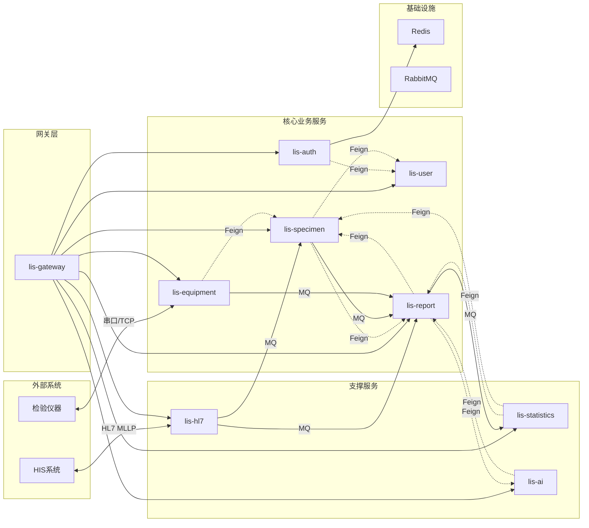
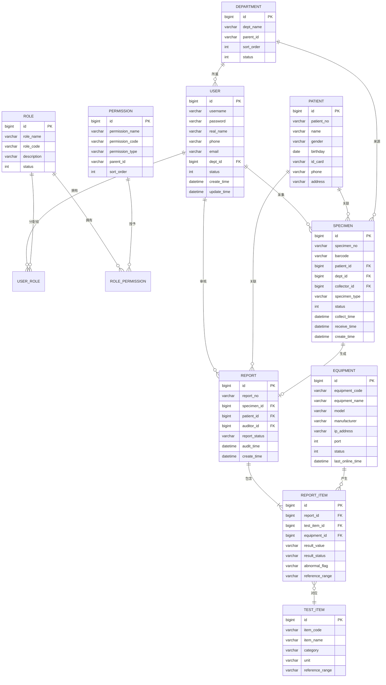

# 概要设计说明书

## 基于微服务架构的实验室管理系统设计与实现

| 文档版本 | V1.0 |
|---------|------|
| 编写日期 | 2026年4月 |
| 项目名称 | 基于微服务架构的实验室管理系统（LIS） |

---

## 目录

- [1 引言](#1-引言)
  - [1.1 编写目的](#11-编写目的)
  - [1.2 编写范围](#12-编写范围)
  - [1.3 定义、缩写词与术语](#13-定义缩写词与术语)
  - [1.4 参考资料](#14-参考资料)
- [2 总体设计](#2-总体设计)
  - [2.1 设计目标](#21-设计目标)
  - [2.2 设计原则](#22-设计原则)
  - [2.3 系统架构设计](#23-系统架构设计)
  - [2.4 技术选型](#24-技术选型)
- [3 模块划分](#3-模块划分)
  - [3.1 微服务功能分配](#31-微服务功能分配)
  - [3.2 模块间关系](#32-模块间关系)
- [4 接口设计](#4-接口设计)
  - [4.1 微服务间接口](#41-微服务间接口)
  - [4.2 前后端接口规范](#42-前后端接口规范)
  - [4.3 HL7接口设计](#43-hl7接口设计)
  - [4.4 外部接口](#44-外部接口)
- [5 数据结构设计](#5-数据结构设计)
  - [5.1 核心实体E-R关系](#51-核心实体er关系)
  - [5.2 数据表概要设计](#52-数据表概要设计)
- [6 运行设计](#6-运行设计)
  - [6.1 运行模块组合](#61-运行模块组合)
  - [6.2 运行控制](#62-运行控制)
  - [6.3 运行时间](#63-运行时间)
- [7 出错处理设计](#7-出错处理设计)
  - [7.1 出错信息](#71-出错信息)
  - [7.2 补救措施](#72-补救措施)
  - [7.3 系统维护设计](#73-系统维护设计)
- [8 安全保密设计](#8-安全保密设计)
  - [8.1 认证机制](#81-认证机制)
  - [8.2 权限控制](#82-权限控制)
  - [8.3 数据加密](#83-数据加密)
  - [8.4 日志审计](#84-日志审计)
- [9 前端架构设计](#9-前端架构设计)
  - [9.1 路由设计](#91-路由设计)
  - [9.2 状态管理](#92-状态管理)
  - [9.3 组件结构](#93-组件结构)
  - [9.4 页面布局](#94-页面布局)

---

## 1 引言

### 1.1 编写目的

本概要设计说明书旨在对"基于微服务架构的实验室管理系统"进行系统级的概要设计描述，明确系统的整体架构、模块划分、接口规范、数据结构、运行机制和安全策略等关键设计要素。本文档的读者对象包括：

- **项目开发人员**：作为后续详细设计和编码实现的指导依据；
- **系统测试人员**：作为制定测试计划和测试用例的参考基础；
- **项目评审人员**：用于评审系统设计方案的技术合理性与可行性；
- **运维部署人员**：了解系统部署架构和运行要求，指导生产环境部署。

本文档在需求分析的基础上，对系统进行高层设计，不涉及具体的代码实现细节，但为详细设计和编码阶段提供明确的技术方向和约束规范。

### 1.2 编写范围

本概要设计说明书覆盖基于微服务架构的实验室管理系统（LIS）的全部功能模块和技术架构，具体包括：

- 系统的微服务架构总体设计，涵盖9个微服务及1个公共模块的职责划分与协作关系；
- 7大业务功能模块的设计：用户管理、标本管理、检验管理、设备管理、HL7接口对接、数据统计、AI辅助诊断；
- 前后端分离架构下的接口设计规范、微服务间通信机制、HL7标准接口对接方案；
- 核心数据实体关系模型与数据库表结构概要；
- 系统运行设计、出错处理策略和安全保密机制；
- 前端Vue.js 3应用的架构设计，包括路由、状态管理、组件体系和页面布局。

本文档不涉及具体的SQL语句编写、前端组件的像素级设计稿、以及第三方系统的内部实现细节。

### 1.3 定义、缩写词与术语

| 术语/缩写 | 全称/定义 |
|-----------|----------|
| LIS | Laboratory Information System，实验室信息系统 |
| HL7 | Health Level Seven，医疗信息交换第七层标准协议 |
| JWT | JSON Web Token，基于JSON的开放标准令牌 |
| CRUD | Create/Read/Update/Delete，增删改查基本操作 |
| RBAC | Role-Based Access Control，基于角色的访问控制 |
| REST | Representational State Transfer，表述性状态转移架构风格 |
| RPC | Remote Procedure Call，远程过程调用 |
| ORM | Object-Relational Mapping，对象关系映射 |
| DTO | Data Transfer Object，数据传输对象 |
| VO | Value Object，值对象 |
| SPA | Single Page Application，单页应用 |
| Nacos | 阿里巴巴开源的服务注册与配置中心 |
| Sentinel | 阿里巴巴开源的流量控制组件 |
| Seata | 阿里巴巴开源的分布式事务解决方案 |
| Docker | 容器化部署平台 |
| API | Application Programming Interface，应用程序编程接口 |
| MLLP | Minimum Lower Layer Protocol，HL7消息传输底层协议 |
| TCP | Transmission Control Protocol，传输控制协议 |

### 1.4 参考资料

1. GB/T 8567-2006《计算机软件文档编制规范》
2. GB/T 9385-2008《计算机软件需求规格说明规范》
3. HL7 Version 2.5.1 Messaging Standard
4. Spring Boot 2.7 官方技术文档（https://spring.io/projects/spring-boot）
5. Spring Cloud Alibaba 官方技术文档（https://spring-cloud-alibaba-group.github.io）
6. Vue.js 3 官方技术文档（https://vuejs.org）
7. Element Plus 官方技术文档（https://element-plus.org）
8. Nacos 官方文档（https://nacos.io）
9. Docker 官方文档（https://docs.docker.com）
10. 《实验室信息系统建设与管理规范》

---

## 2 总体设计

### 2.1 设计目标

本系统的总体设计目标是在满足实验室日常业务需求的基础上，构建一个高可用、高性能、易扩展、安全可靠的微服务架构实验室信息管理系统。具体设计目标如下：

**（1）业务功能目标**

- 实现实验室标本从采集、接收、检测到报告出具的全流程数字化管理；
- 支持多类型检验项目的申请、执行与结果录入；
- 提供设备联机通讯能力，实现检验仪器的自动化数据采集；
- 对接HL7标准协议，实现与医院HIS系统的无缝集成；
- 提供多维度的数据统计分析功能，辅助实验室管理决策；
- 引入AI辅助诊断能力，提升检验结果的审核效率和准确性。

**（2）技术架构目标**

- 采用微服务架构，实现各业务模块的独立开发、独立部署和独立扩展；
- 前后端分离，前端采用Vue.js 3构建响应式单页应用，后端提供RESTful API；
- 支持水平扩展，核心服务支持多实例部署与负载均衡；
- 系统可用性达到99.9%，核心接口响应时间不超过500ms；
- 支持Docker容器化部署，实现一键式环境搭建与版本发布。

**（3）安全合规目标**

- 实现基于RBAC模型的细粒度权限控制；
- 全链路数据加密传输，敏感数据加密存储；
- 完整的操作日志审计追踪机制；
- 符合医疗信息系统安全等级保护要求。

### 2.2 设计原则

本系统在设计过程中遵循以下核心原则：

**（1）单一职责原则（SRP）**

每个微服务专注于单一业务领域，拥有独立的数据库和业务逻辑。例如，标本服务仅负责标本全生命周期管理，不涉及用户认证或设备通讯等职责，从而降低系统耦合度，提升可维护性。

**（2）服务自治原则**

各微服务在开发、部署、运行层面保持高度自治。每个服务可独立进行技术选型迭代、独立进行数据库Schema变更、独立进行版本发布，服务之间通过定义良好的API契约进行协作。

**（3）高内聚低耦合原则**

业务逻辑高度内聚于各自的微服务内部，服务间通过RESTful API或消息队列进行松耦合通信，避免数据库层面的直接交叉访问，确保服务边界清晰。

**（4）面向失败设计原则**

系统设计充分考虑各种故障场景，包括服务宕机、网络超时、数据库不可用等。通过熔断降级（Sentinel）、重试机制、超时控制、优雅停机等策略，确保系统在部分组件故障时仍能提供核心功能。

**（5）可扩展性原则**

系统架构支持横向水平扩展。无状态服务（如API网关、认证服务等）可通过增加实例数量提升处理能力；有状态组件（如MySQL、Redis）通过主从复制、分库分表等方案支撑数据增长。

**（6）标准化原则**

对外接口遵循RESTful API设计规范，医疗数据交换遵循HL7 V2.x标准协议，日志格式统一采用JSON结构化日志，确保系统各组成部分的规范一致性。

**（7）前后端分离原则**

前端与后端通过HTTP API进行数据交互，前端负责页面渲染与用户交互，后端负责业务逻辑处理与数据持久化。前后端可并行开发、独立部署，提升开发效率。

### 2.3 系统架构设计

本系统采用分层微服务架构，整体分为基础设施层、数据存储层、微服务层、API网关层和前端展示层五个层次。

#### 系统架构图（Mermaid）

```mermaid
graph TB
    subgraph 前端展示层
        A[Vue.js 3 + Element Plus<br/>单页应用 SPA]
    end

    subgraph API网关层
        GW[lis-gateway :8080<br/>Spring Cloud Gateway<br/>路由转发 / 限流 / 鉴权]
    end

    subgraph 微服务层
        S1[lis-auth :8081<br/>认证服务]
        S2[lis-user :8082<br/>用户服务]
        S3[lis-specimen :8083<br/>标本服务]
        S4[lis-report :8084<br/>检验服务]
        S5[lis-equipment :8085<br/>设备服务]
        S6[lis-hl7 :8086<br/>HL7服务]
        S7[lis-statistics :8087<br/>统计服务]
        S8[lis-ai :8088<br/>AI服务]
    end

    subgraph 公共模块
        CM[lis-common<br/>工具类 / 公共实体 / 异常处理]
    end

    subgraph 服务治理
        NC[Nacos<br/>注册中心 + 配置中心]
        SC[Sentinel<br/>熔断降级]
        ST[Seata<br/>分布式事务]
    end

    subgraph 数据存储层
        DB1[(lis_user_db)]
        DB2[(lis_specimen_db)]
        DB3[(lis_report_db)]
        DB4[(lis_equipment_db)]
        DB5[(lis_hl7_db)]
        DB6[(lis_statistics_db)]
        RD[(Redis<br/>缓存 / 会话)]
        MQ[RabbitMQ<br/>消息队列]
    end

    subgraph 基础设施层
        DK[Docker<br/>容器化部署]
        ES[ELK<br/>日志收集]
        PM[Prometheus + Grafana<br/>监控告警]
    end

    A -->|HTTP/HTTPS| GW
    GW --> S1
    GW --> S2
    GW --> S3
    GW --> S4
    GW --> S5
    GW --> S6
    GW --> S7
    GW --> S8

    S1 -.-> NC
    S2 -.-> NC
    S3 -.-> NC
    S4 -.-> NC
    S5 -.-> NC
    S6 -.-> NC
    S7 -.-> NC
    S8 -.-> NC

    S1 -.-> SC
    S2 -.-> SC
    S3 -.-> SC
    S4 -.-> SC
    S5 -.-> SC
    S6 -.-> SC
    S7 -.-> SC
    S8 -.-> SC

    S3 -.-> ST
    S4 -.-> ST

    S1 --> CM
    S2 --> CM
    S3 --> CM
    S4 --> CM
    S5 --> CM
    S6 --> CM
    S7 --> CM
    S8 --> CM

    S2 --> DB1
    S3 --> DB2
    S4 --> DB3
    S5 --> DB4
    S6 --> DB5
    S7 --> DB6

    S1 --> RD
    S2 --> RD
    S3 --> RD
    S4 --> RD

    S3 --> MQ
    S4 --> MQ
    S6 --> MQ

    S1 -.-> ES
    S2 -.-> ES
    S3 -.-> ES
    S4 -.-> ES
    S5 -.-> ES
    S6 -.-> ES
    S7 -.-> ES
    S8 -.-> ES

    S1 -.-> PM
    S2 -.-> PM
    S3 -.-> PM
    S4 -.-> PM
    S5 -.-> PM
    S6 -.-> PM
    S7 -.-> PM
    S8 -.-> PM
```



#### 架构分层说明

**第一层：前端展示层**

采用Vue.js 3 + Element Plus构建的单页应用（SPA），运行在用户浏览器中。通过Axios HTTP客户端与后端API网关进行通信，负责页面渲染、用户交互、表单验证和数据展示。前端应用通过Nginx进行静态资源托管和反向代理。

**第二层：API网关层**

基于Spring Cloud Gateway构建的统一入口网关（lis-gateway），承担路由转发、统一鉴权、接口限流、请求日志、跨域处理等横切关注点。所有前端请求均通过网关统一分发至后端各微服务，前端无需感知后端服务的具体地址和数量。

**第三层：微服务层**

系统的核心业务逻辑层，包含8个独立运行的微服务（lis-auth、lis-user、lis-specimen、lis-report、lis-equipment、lis-hl7、lis-statistics、lis-ai）和1个公共模块（lis-common）。每个微服务基于Spring Boot 2.7独立构建，拥有独立的数据库实例，通过Nacos进行服务注册与发现。

**第四层：数据存储层**

采用多数据源架构，每个微服务拥有独立的MySQL数据库实例，实现数据物理隔离。Redis作为分布式缓存和会话存储，提升热点数据访问性能。RabbitMQ作为异步消息中间件，用于微服务间的异步通信和事件驱动。

**第五层：基础设施层**

基于Docker实现全部组件的容器化部署，通过Docker Compose编排服务依赖关系。ELK（Elasticsearch + Logstash + Kibana）负责日志集中收集与分析。Prometheus + Grafana负责系统指标采集与可视化监控告警。

### 2.4 技术选型

#### 后端技术栈

| 技术组件 | 版本 | 用途说明 |
|---------|------|---------|
| Java | JDK 17 | 后端开发语言 |
| Spring Boot | 2.7.x | 微服务基础框架，简化配置与部署 |
| Spring Cloud Alibaba | 2021.x | 微服务治理框架套件 |
| Spring Cloud Gateway | 3.1.x | API网关，路由转发与过滤器链 |
| Nacos | 2.3.0 | 服务注册中心与分布式配置中心 |
| Sentinel | 1.8.x | 流量控制、熔断降级、系统保护 |
| Seata | 1.5.x | 分布式事务解决方案（AT模式） |
| OpenFeign | 3.1.x | 声明式HTTP客户端，微服务间调用 |
| MyBatis-Plus | 3.5.x | ORM框架，简化数据库操作 |
| MySQL | 8.0 | 关系型数据库，业务数据持久化 |
| Redis | 6.x | 分布式缓存、会话管理、分布式锁 |
| RabbitMQ | 3.10.x | 消息队列，异步解耦与事件驱动 |
| HAPI HL7v2 | 2.5 | HL7 V2.x消息解析与构建库 |
| JWT（jjwt） | 0.11.x | JSON Web Token生成与验证 |
| Lombok | 1.18.x | 代码简化工具，自动生成Getter/Setter |
| Knife4j | 3.0.x | API文档生成与在线调试工具 |
| Docker | 20.x | 容器化部署平台 |

#### 前端技术栈

| 技术组件 | 版本 | 用途说明 |
|---------|------|---------|
| Vue.js | 3.3.x | 渐进式JavaScript框架，构建用户界面 |
| Vite | 4.x | 下一代前端构建工具，开发服务器与打包 |
| TypeScript | 5.x | JavaScript超集，提供静态类型检查 |
| Element Plus | 2.3.x | 基于Vue 3的企业级UI组件库 |
| Pinia | 2.1.x | Vue 3官方状态管理库 |
| Vue Router | 4.x | Vue 3官方路由管理器 |
| Axios | 1.4.x | 基于Promise的HTTP客户端 |
| ECharts | 5.4.x | 数据可视化图表库 |
| VueUse | 10.x | Vue Composition API实用工具集 |

#### 开发与部署工具

| 工具 | 用途说明 |
|------|---------|
| IntelliJ IDEA | 后端集成开发环境 |
| VS Code | 前端集成开发环境 |
| Git | 版本控制 |
| Maven | Java项目构建与依赖管理 |
| npm/pnpm | 前端包管理器 |
| Docker Compose | 多容器编排部署 |
| Nginx | 前端静态资源托管与反向代理 |
| Postman | API接口测试工具 |

---

## 3 模块划分

### 3.1 微服务功能分配

本系统共划分为9个微服务模块（含1个公共模块），各模块的职责与功能分配如下：

#### 3.1.1 lis-gateway（API网关服务，端口8080）

API网关是系统的统一入口，负责所有外部请求的接收与分发。

| 功能项 | 功能描述 |
|-------|---------|
| 路由转发 | 根据请求路径将请求路由至对应的后端微服务，支持路径匹配、权重路由 |
| 统一鉴权 | 对需要认证的请求进行JWT Token校验，未携带或无效Token的请求返回401 |
| 接口限流 | 基于Sentinel实现请求限流，防止恶意请求和突发流量冲击后端服务 |
| 跨域处理 | 统一配置CORS策略，解决前后端分离架构下的跨域请求问题 |
| 请求日志 | 记录所有请求的访问日志，包括请求路径、响应状态码、响应耗时等 |
| 响应封装 | 统一封装后端微服务的响应格式，屏蔽内部服务差异 |

#### 3.1.2 lis-auth（认证服务，端口8081）

负责系统用户的身份认证与授权令牌管理。

| 功能项 | 功能描述 |
|-------|---------|
| 用户登录 | 接收用户名/密码，验证身份后签发JWT Access Token和Refresh Token |
| 令牌刷新 | 当Access Token过期时，通过Refresh Token获取新的Access Token |
| 令牌管理 | 将已签发的Token存储至Redis，支持主动注销和强制下线 |
| 登出处理 | 清除Redis中的Token缓存，使当前令牌立即失效 |
| 密码加密 | 使用BCrypt算法对用户密码进行单向加密存储与验证 |

#### 3.1.3 lis-user（用户服务，端口8082）

负责系统用户、角色、权限的管理。

| 功能项 | 功能描述 |
|-------|---------|
| 用户管理 | 用户的增删改查、批量导入导出、密码重置、账号启停用 |
| 角色管理 | 角色的增删改查、角色权限分配 |
| 权限管理 | 菜单权限和操作权限的配置与管理 |
| 部门管理 | 组织架构的树形管理，支持多级部门嵌套 |
| 用户-角色关联 | 维护用户与角色的多对多关联关系 |
| 角色-权限关联 | 维护角色与权限的多对多关联关系 |

#### 3.1.4 lis-specimen（标本服务，端口8083）

负责检验标本的全生命周期管理。

| 功能项 | 功能描述 |
|-------|---------|
| 标本申请 | 接收检验申请，生成标本条码，打印标本标签 |
| 标本采集 | 记录标本采集时间、采集人、采集部位等信息 |
| 标本接收 | 确认标本送达实验室，校验标本质量与信息完整性 |
| 标本检测 | 记录标本进入检测环节的状态流转 |
| 标本拒收 | 对不合格标本进行拒收处理，记录拒收原因 |
| 标本查询 | 多条件组合查询标本信息及状态追踪 |
| 条码管理 | 标本条码的生成、打印、扫描识别 |

#### 3.1.5 lis-report（检验服务，端口8084）

负责检验申请、检验结果录入与检验报告管理。

| 功能项 | 功能描述 |
|-------|---------|
| 检验申请管理 | 创建、编辑、作废检验申请单，关联患者与检验项目 |
| 结果录入 | 手动录入或自动接收检验仪器回传的检测结果 |
| 结果审核 | 对检验结果进行审核确认，支持多级审核流程 |
| 报告生成 | 根据审核通过的检验结果自动生成检验报告 |
| 报告打印 | 支持多种报告模板的打印输出 |
| 危急值管理 | 对超出危急值范围的检验结果进行标记与即时通知 |
| 历史查询 | 查询患者历史检验记录，支持结果对比分析 |

#### 3.1.6 lis-equipment（设备服务，端口8085）

负责检验设备的台账管理与联机通讯。

| 功能项 | 功能描述 |
|-------|---------|
| 设备台账 | 设备基本信息的登记、编辑、查询，包括设备编号、型号、厂家等 |
| 设备状态监控 | 实时监控设备在线/离线/故障状态 |
| 联机通讯 | 通过串口或TCP协议与检验仪器建立通讯连接 |
| 数据采集 | 接收并解析检验仪器发送的检测结果数据 |
| 维护保养 | 设备维护保养计划制定与执行记录 |
| 校准管理 | 设备校准周期管理与校准记录 |

#### 3.1.7 lis-hl7（HL7服务，端口8086）

负责与医院HIS系统等外部系统的HL7标准协议对接。

| 功能项 | 功能描述 |
|-------|---------|
| HL7消息解析 | 解析接收到的HL7 V2.x格式消息（ADT、ORM、ORU等） |
| HL7消息构建 | 按照HL7标准构建发送消息，如检验申请确认（ORR）、结果报告（ORU） |
| MLLP协议通讯 | 基于MLLP底层协议实现HL7消息的TCP传输 |
| 消息路由 | 根据消息类型将HL7消息分发至对应的业务微服务处理 |
| 消息日志 | 记录所有收发的HL7消息原始报文，便于问题排查与追溯 |
| ACK应答 | 对接收到的HL7消息自动返回应用确认（ACK） |

#### 3.1.8 lis-statistics（统计服务，端口8087）

负责实验室业务数据的统计与分析。

| 功能项 | 功能描述 |
|-------|---------|
| 标本统计 | 按时间段、科室、标本类型等维度统计标本量 |
| 检验统计 | 检验项目工作量统计、阳性率统计、TAT（周转时间）统计 |
| 设备统计 | 设备使用率统计、故障率统计 |
| 人员统计 | 检验人员工作量统计、审核量统计 |
| 收入统计 | 检验收入汇总与趋势分析 |
| 报表导出 | 支持统计结果导出为Excel、PDF格式 |

#### 3.1.9 lis-ai（AI辅助诊断服务，端口8088）

负责提供AI辅助诊断分析能力。

| 功能项 | 功能描述 |
|-------|---------|
| 结果异常分析 | 基于历史数据与规则引擎，识别检验结果中的潜在异常模式 |
| 辅助审核建议 | 对检验结果提供AI审核建议，标记可疑结果供人工复核 |
| 参考范围预测 | 结合患者基本信息（年龄、性别等）动态调整参考范围 |
| 趋势分析 | 分析患者多次检验结果的变化趋势，提供趋势预警 |
| 诊断建议 | 基于检验结果组合，提供可能的诊断方向参考 |

#### 3.1.10 lis-common（公共模块）

非独立运行的微服务，作为公共依赖被其他微服务引用。

| 功能项 | 功能描述 |
|-------|---------|
| 统一响应封装 | 定义统一的API响应格式（Result<T>），包含状态码、消息、数据 |
| 全局异常处理 | 定义业务异常体系，提供全局异常处理器 |
| 公共实体类 | 定义分页请求/响应、树形结构等通用数据结构 |
| 工具类库 | 提供字符串处理、日期处理、Bean拷贝等常用工具方法 |
| 常量定义 | 定义系统级常量，如状态码枚举、业务常量等 |
| JWT工具 | 提供JWT Token的生成、解析、验证工具方法 |
| Redis工具 | 封装Redis常用操作，提供分布式锁等高级功能 |

### 3.2 模块间关系

#### 模块关系图（Mermaid）



#### 模块间调用关系说明

**（1）认证链路**

前端请求携带JWT Token访问API网关，网关通过Redis验证Token有效性（Token由lis-auth签发并存入Redis）。网关将解析后的用户信息注入请求头，转发至目标微服务。目标微服务从请求头提取用户信息进行业务处理。

**（2）标本-检验业务链路**

标本服务（lis-specimen）与检验服务（lis-report）之间存在紧密的业务关联。当标本进入检测环节后，标本服务通过RabbitMQ发送异步消息通知检验服务；检验服务完成结果录入后，通过Feign同步调用标本服务更新标本状态。这种同步+异步混合的通信模式既保证了关键业务的数据一致性，又避免了同步调用带来的性能瓶颈。

**（3）设备-检验数据链路**

设备服务（lis-equipment）通过串口或TCP协议与检验仪器建立连接，实时接收检验结果数据。设备服务将解析后的结果数据通过RabbitMQ异步发送至检验服务（lis-report），由检验服务完成结果入库与报告生成。这种异步解耦的设计确保了设备数据采集不会因检验服务的处理延迟而丢失数据。

**（4）HL7集成链路**

HL7服务（lis-hl7）作为系统与外部HIS系统的集成桥梁，接收HIS发送的检验申请消息（ORM）和患者信息消息（ADT），解析后通过消息队列分发至标本服务和检验服务。检验完成后，HL7服务将检验结果封装为HL7 ORU消息回传至HIS系统。

**（5）AI辅助链路**

检验服务在结果审核环节，通过Feign调用AI服务获取辅助审核建议。AI服务基于规则引擎和历史数据分析，返回异常标记和审核建议，供检验人员参考。该调用采用异步非阻塞方式，不阻塞主审核流程。

**（6）统计链路**

统计服务通过Feign调用标本服务和检验服务获取原始业务数据，进行聚合计算后返回统计结果。对于大数据量的统计查询，统计服务直接读取各业务数据库的只读从库，避免对主库造成压力。

---

## 4 接口设计

### 4.1 微服务间接口

微服务间采用两种通信方式：同步调用（OpenFeign）和异步消息（RabbitMQ）。

#### 4.1.1 同步接口（OpenFeign）

| 调用方 | 被调用方 | 接口路径 | 方法 | 功能描述 |
|-------|---------|---------|------|---------|
| lis-auth | lis-user | /api/user/findByUsername | GET | 根据用户名查询用户信息 |
| lis-specimen | lis-user | /api/user/getById/{id} | GET | 根据用户ID查询用户信息 |
| lis-specimen | lis-report | /api/report/getBySpecimenId/{id} | GET | 根据标本ID查询检验报告 |
| lis-report | lis-specimen | /api/specimen/updateStatus | PUT | 更新标本检测状态 |
| lis-report | lis-ai | /api/ai/analyze | POST | 请求AI辅助诊断分析 |
| lis-equipment | lis-specimen | /api/specimen/getByBarcode/{barcode} | GET | 根据条码查询标本信息 |
| lis-statistics | lis-report | /api/report/statistics | POST | 获取检验统计数据 |
| lis-statistics | lis-specimen | /api/specimen/statistics | POST | 获取标本统计数据 |

#### 4.1.2 异步消息接口（RabbitMQ）

| 消息生产者 | 消息消费者 | 交换机 | 路由键 | 消息内容 |
|-----------|-----------|-------|-------|---------|
| lis-specimen | lis-report | lis.direct | specimen.detected | 标本进入检测通知 |
| lis-equipment | lis-report | lis.direct | equipment.result | 仪器检验结果数据 |
| lis-hl7 | lis-specimen | lis.direct | hl7.order | HL7检验申请消息 |
| lis-hl7 | lis-report | lis.direct | hl7.result.request | HL7结果查询请求 |
| lis-report | lis-statistics | lis.topic | report.completed | 检验报告完成通知 |

#### 4.1.3 Feign调用熔断降级策略

所有Feign调用均配置Sentinel熔断降级规则：

- **慢调用比例**：当响应时间超过500ms的调用比例超过60%时触发熔断，熔断时长10秒；
- **异常比例**：当异常调用比例超过50%时触发熔断，熔断时长15秒；
- **降级策略**：熔断触发后返回兜底数据或抛出业务友好异常提示，而非底层错误信息。

### 4.2 前后端接口规范

#### 4.2.1 RESTful API设计规范

所有前后端接口遵循RESTful设计风格，具体规范如下：

**请求路径规范**

```
GET    /api/{资源名}              # 查询资源列表
GET    /api/{资源名}/{id}         # 查询单个资源详情
POST   /api/{资源名}              # 创建新资源
PUT    /api/{资源名}/{id}         # 更新资源（全量）
DELETE /api/{资源名}/{id}         # 删除资源
GET    /api/{资源名}/page         # 分页查询资源列表
```

**统一响应格式**

```json
{
  "code": 200,
  "message": "操作成功",
  "data": { },
  "timestamp": 1712345678000
}
```

| 字段 | 类型 | 说明 |
|------|------|------|
| code | Integer | 状态码，200成功，400参数错误，401未认证，403无权限，500服务器错误 |
| message | String | 响应消息描述 |
| data | Object | 响应数据体，可为对象、数组或null |
| timestamp | Long | 响应时间戳（毫秒） |

**分页响应格式**

```json
{
  "code": 200,
  "message": "查询成功",
  "data": {
    "records": [],
    "total": 100,
    "pageSize": 10,
    "pageNum": 1,
    "totalPages": 10
  }
}
```

**请求头规范**

| Header | 是否必须 | 说明 |
|--------|---------|------|
| Authorization | 是（需认证接口） | Bearer {JWT Token} |
| Content-Type | 是 | application/json |
| X-Request-Id | 否 | 请求追踪ID，用于链路追踪 |

#### 4.2.2 核心业务接口清单

**认证接口**

| 接口 | 方法 | 路径 | 说明 |
|------|------|------|------|
| 用户登录 | POST | /api/auth/login | 用户名密码登录，返回Token |
| 令牌刷新 | POST | /api/auth/refresh | 刷新Access Token |
| 用户登出 | POST | /api/auth/logout | 注销当前Token |

**用户管理接口**

| 接口 | 方法 | 路径 | 说明 |
|------|------|------|------|
| 用户列表 | GET | /api/user/page | 分页查询用户列表 |
| 新增用户 | POST | /api/user | 新增用户 |
| 修改用户 | PUT | /api/user/{id} | 修改用户信息 |
| 删除用户 | DELETE | /api/user/{id} | 删除用户 |
| 重置密码 | PUT | /api/user/{id}/password | 重置用户密码 |
| 角色列表 | GET | /api/role/list | 查询所有角色 |
| 分配角色 | PUT | /api/user/{id}/roles | 为用户分配角色 |

**标本管理接口**

| 接口 | 方法 | 路径 | 说明 |
|------|------|------|------|
| 标本列表 | GET | /api/specimen/page | 分页查询标本列表 |
| 标本详情 | GET | /api/specimen/{id} | 查询标本详情 |
| 标本接收 | PUT | /api/specimen/{id}/receive | 标本签收 |
| 标本拒收 | PUT | /api/specimen/{id}/reject | 标本拒收 |
| 条码打印 | GET | /api/specimen/{id}/barcode | 获取条码打印数据 |

**检验管理接口**

| 接口 | 方法 | 路径 | 说明 |
|------|------|------|------|
| 申请列表 | GET | /api/report/application/page | 分页查询检验申请 |
| 创建申请 | POST | /api/report/application | 创建检验申请 |
| 结果录入 | POST | /api/report/result | 录入检验结果 |
| 结果审核 | PUT | /api/report/{id}/audit | 审核检验结果 |
| 报告查询 | GET | /api/report/{id} | 查询检验报告 |
| 报告打印 | GET | /api/report/{id}/print | 获取报告打印数据 |

### 4.3 HL7接口设计

#### 4.3.1 支持的HL7消息类型

| 消息类型 | 触发事件 | 方向 | 说明 |
|---------|---------|------|------|
| ADT^A01 | 患者入院 | HIS → LIS | 接收患者入院登记信息 |
| ADT^A04 | 患者登记 | HIS → LIS | 接收患者门诊登记信息 |
| ORM^O01 | 检验申请 | HIS → LIS | 接收HIS发起的检验申请 |
| ORL^O22 | 检验申请响应 | LIS → HIS | 返回检验申请确认/拒绝 |
| ORU^R01 | 检验结果 | LIS → HIS | 回传检验结果报告 |
| ACK | 应用确认 | 双向 | 消息接收确认应答 |

#### 4.3.2 HL7消息通讯机制

HL7消息传输基于MLLP（Minimum Lower Layer Protocol）协议，在TCP之上进行消息封装。通讯流程如下：

```
HIS系统                                        LIS系统（lis-hl7）
  |                                               |
  |--- [0x0B] HL7消息体 [0x1C][0x0D] ---------->|
  |                                               | 1. 解析MLLP封装
  |                                               | 2. 解析HL7消息
  |                                               | 3. 业务处理
  |                                               | 4. 构建ACK消息
  |<-- [0x0B] ACK消息 [0x1C][0x0D] --------------|
  |                                               | 5. 异步分发业务消息
  |                                               |    至对应微服务
```

#### 4.3.3 ORM^O01检验申请消息示例

```
MSH|^~\&|HIS|HOSPITAL|LIS|LAB|20260406120000||ORM^O01|MSG00001|P|2.5.1|||AL|NE|CHN
PID|1||PAT001||张三||19850101|M
PV1|1|O|内科门诊^^^HOSPITAL||||DR001^李医生
ORC|NW|ORD001|||SC||^|^20260406120000
OBR|1|ORD001||CBC^血常规^^^LIS|||20260406120000
OBX|1|NM|WBC^白细胞||6.5|10^9/L|4.0-10.0||N|||F
OBX|2|NM|RBC^红细胞||4.8|10^12/L|3.5-5.5||N|||F
OBX|3|NM|HGB^血红蛋白||140|g/L|120-160||N|||F
```

### 4.4 外部接口

#### 4.4.1 设备通讯接口

设备服务通过以下两种协议与检验仪器进行通讯：

**（1）串口通讯（RS-232/RS-485）**

- 适用场景：本地直连的检验仪器；
- 通讯参数：波特率（9600/19200）、数据位（8）、停止位（1）、校验位（None）；
- 数据格式：遵循各仪器厂商的ASTM或自定义协议；
- 解析策略：通过可配置的协议解析器，将仪器原始数据转换为标准检验结果格式。

**（2）TCP/IP通讯**

- 适用场景：网络连接的检验仪器或仪器数据采集工作站；
- 通讯协议：TCP Socket长连接，支持心跳保活；
- 数据格式：支持HL7 V2.x、ASTM等标准协议，以及厂商自定义协议；
- 连接管理：支持多设备并发连接，自动重连机制。

#### 4.4.2 AI模型接口

AI服务对外暴露RESTful API，支持与外部AI模型的集成：

| 接口 | 方法 | 路径 | 说明 |
|------|------|------|------|
| 结果分析 | POST | /api/ai/analyze | 提交检验结果进行AI分析 |
| 趋势预测 | POST | /api/ai/trend | 提交历史数据进行趋势预测 |
| 异常检测 | POST | /api/ai/anomaly | 检测检验结果异常模式 |

AI服务内部可对接本地规则引擎或远程AI模型服务（如TensorFlow Serving），通过策略模式实现多种AI后端的灵活切换。

---

## 5 数据结构设计

### 5.1 核心实体E-R关系

#### 核心实体关系图（Mermaid）



#### 核心实体关系说明

**（1）用户-角色-权限关系**

用户（USER）与角色（ROLE）之间为多对多关系，通过中间表USER_ROLE关联。角色（ROLE）与权限（PERMISSION）之间同样为多对多关系，通过中间表ROLE_PERMISSION关联。这种RBAC模型支持灵活的权限配置：一个用户可拥有多个角色，一个角色可关联多个权限。

**（2）患者-标本-报告关系**

患者（PATIENT）与标本（SPECIMEN）为一对多关系，一个患者可有多份标本。标本（SPECIMEN）与报告（REPORT）为一对一关系，一份标本对应一份检验报告。报告（REPORT）与报告明细（REPORT_ITEM）为一对多关系，一份报告包含多个检验项目结果。报告明细（REPORT_ITEM）与检验项目（TEST_ITEM）为多对一关系，引用标准检验项目定义。

**（3）设备-报告明细关系**

设备（EQUIPMENT）与报告明细（REPORT_ITEM）为一对多关系，记录每个检验结果是由哪台设备产生的，便于结果溯源和质量控制。

**（4）科室-用户/标本关系**

科室（DEPARTMENT）与用户（USER）为一对多关系，用户归属于某个科室。科室（DEPARTMENT）与标本（SPECIMEN）为一对多关系，记录标本的来源科室。

### 5.2 数据表概要设计

本系统采用分库策略，每个微服务拥有独立的数据库实例。以下列出各数据库的核心数据表：

#### lis_user_db（用户数据库）

| 表名 | 中文名 | 主要字段 | 说明 |
|------|-------|---------|------|
| sys_user | 系统用户表 | id, username, password, real_name, phone, email, dept_id, status | 存储系统用户基本信息 |
| sys_role | 系统角色表 | id, role_name, role_code, description, status | 存储角色定义 |
| sys_menu | 系统菜单表 | id, menu_name, path, component, permission, icon, sort, menu_type, parent_id | 存储菜单和操作权限 |
| sys_user_role | 用户角色关联表 | user_id, role_id | 用户与角色多对多关联 |
| sys_role_menu | 角色菜单关联表 | role_id, menu_id | 角色与菜单多对多关联 |
| sys_department | 部门表 | id, dept_name, parent_id, sort_order, status | 组织架构树形结构 |
| sys_dict | 数据字典表 | id, dict_type, dict_label, dict_value, sort_order | 系统数据字典 |
| sys_operate_log | 操作日志表 | id, user_id, module, operation, ip, request_url, create_time | 用户操作审计日志 |

#### lis_specimen_db（标本数据库）

| 表名 | 中文名 | 主要字段 | 说明 |
|------|-------|---------|------|
| lis_patient | 患者信息表 | id, patient_no, name, gender, birthday, id_card, phone | 患者基本信息 |
| lis_specimen | 标本信息表 | id, specimen_no, barcode, patient_id, dept_id, collector_id, specimen_type, status, collect_time, receive_time | 标本全生命周期数据 |
| specimen_trace | 标本追溯表 | id, specimen_id, operator_id, action, remark, create_time | 标本状态变更日志 |

#### lis_report_db（检验数据库）

| 表名 | 中文名 | 主要字段 | 说明 |
|------|-------|---------|------|
| lis_test_item | 检验项目表 | id, item_code, item_name, category, unit, reference_range | 标准检验项目定义 |
| lis_test_profile | 检验组合表 | id, profile_code, profile_name, category | 检验项目组合定义 |
| lis_profile_item | 组合项目关联表 | profile_id, item_id | 组合与项目的关联 |
| lis_application | 检验申请表 | id, application_no, patient_id, specimen_id, profile_id, status, request_doctor, request_time | 检验申请单 |
| lis_report | 检验报告表 | id, report_no, specimen_id, patient_id, application_id, auditor_id, report_status, audit_time | 检验报告主表 |
| lis_report_item | 报告明细表 | id, report_id, test_item_id, equipment_id, result_value, result_status, abnormal_flag, reference_range | 检验结果明细 |
| lis_critical_value | 危急值记录表 | id, report_item_id, reporter_id, notifier_id, patient_id, notify_time, handle_status | 危急值通知记录 |

#### lis_equipment_db（设备数据库）

| 表名 | 中文名 | 主要字段 | 说明 |
|------|-------|---------|------|
| lis_equipment | 设备信息表 | id, equipment_code, equipment_name, model, manufacturer, ip_address, port, protocol, status | 设备台账 |
| lis_equipment_protocol | 设备协议配置表 | id, equipment_id, protocol_type, baud_rate, data_bits, stop_bits, parity | 通讯协议参数 |
| lis_equipment_maintenance | 设备维护记录表 | id, equipment_id, maintenance_type, maintenance_date, maintainer, content, cost | 维护保养记录 |
| lis_equipment_calibration | 设备校准记录表 | id, equipment_id, calibration_date, calibrator, result, next_calibration_date | 校准记录 |

#### lis_hl7_db（HL7数据库）

| 表名 | 中文名 | 主要字段 | 说明 |
|------|-------|---------|------|
| lis_hl7_message | HL7消息日志表 | id, message_id, message_type, direction, raw_message, parsed_data, send_system, receive_system, create_time | HL7消息收发日志 |
| lis_hl7_config | HL7接口配置表 | id, config_name, remote_ip, remote_port, local_port, enabled | HL7通讯连接配置 |

#### lis_statistics_db（统计数据库）

| 表名 | 中文名 | 主要字段 | 说明 |
|------|-------|---------|------|
| lis_stat_daily | 日统计表 | id, stat_date, dept_id, specimen_count, report_count, revenue | 每日业务量汇总 |
| lis_stat_monthly | 月统计表 | id, stat_month, dept_id, specimen_count, report_count, revenue | 每月业务量汇总 |
| lis_stat_tat | TAT统计表 | id, stat_date, specimen_type, avg_tat, max_tat, min_tat | 标本周转时间统计 |

---

## 6 运行设计

### 6.1 运行模块组合

系统在正常运行时，各模块的启动与组合关系如下：

#### 启动顺序

```
阶段1 - 基础设施启动：
  MySQL 8.0（各实例） → Redis 7.x → RabbitMQ → Nacos Server

阶段2 - 微服务启动（无严格顺序，可并行）：
  lis-common（编译依赖，非运行时服务）
  lis-auth → lis-user → lis-specimen → lis-report → lis-equipment
  → lis-hl7 → lis-statistics → lis-ai

阶段3 - 网关启动：
  lis-gateway（依赖所有业务服务注册至Nacos后启动）

阶段4 - 前端启动：
  Nginx（托管Vue.js 3编译产物）
```

#### 运行时模块组合场景

**场景一：用户登录**

```
浏览器 → Nginx → lis-gateway → lis-auth → Redis
```

用户在前端输入用户名密码，请求经Nginx转发至API网关，网关路由至认证服务，认证服务验证通过后签发JWT Token并存入Redis，返回Token给前端。

**场景二：标本全流程**

```
HIS → lis-hl7 → RabbitMQ → lis-specimen → MySQL
                                    ↓
                              lis-report（异步通知）
                                    ↓
                              lis-equipment（联机采集）→ RabbitMQ → lis-report
                                    ↓
                              lis-ai（辅助审核）→ lis-report
                                    ↓
                              lis-hl7 → HIS（结果回传）
```

**场景三：数据统计查询**

```
浏览器 → Nginx → lis-gateway → lis-statistics → lis-report（Feign）
                                                  → lis-specimen（Feign）
                                                  → MySQL（只读从库）
```

### 6.2 运行控制

#### 服务注册与发现

所有微服务启动时自动向Nacos注册中心注册自身实例信息（IP、端口、服务名）。服务间通过Nacos进行服务发现，获取目标服务的可用实例列表，结合Ribbon负载均衡策略选择实例进行调用。

#### 配置管理

系统配置分为三个层级：

- **Bootstrap配置**：各服务的Nacos连接地址等基础配置，存储在各服务的bootstrap.yml中；
- **应用配置**：各微服务的业务配置（数据库连接、Redis地址、业务参数等），存储在Nacos配置中心，支持动态刷新；
- **环境配置**：通过Nacos的Namespace机制区分开发（dev）、测试（test）、生产（prod）环境。

#### 流量控制

基于Sentinel实现多维度流量控制：

- **网关限流**：对API网关的入口请求按路由ID进行QPS限流，超出阈值的请求返回429状态码；
- **服务限流**：对核心服务接口（如结果录入、报告审核）配置QPS限流规则；
- **热点参数限流**：对携带特定参数的请求进行细粒度限流；
- **系统保护**：基于系统负载（CPU使用率、内存使用率）自适应流量控制。

#### 服务熔断与降级

当微服务间调用出现异常或超时时，Sentinel自动触发熔断：

- **熔断状态**：熔断触发后，后续请求直接走降级逻辑，不再调用目标服务；
- **降级策略**：核心业务返回兜底数据或友好提示，非核心业务（如AI分析）直接跳过；
- **恢复探测**：熔断时间窗口结束后，Sentinel自动放行少量探测请求，根据探测结果决定是否恢复。

### 6.3 运行时间

#### 系统可用性

- 系统设计可用性目标：99.9%（年度停机时间不超过8.76小时）；
- 计划内维护窗口：每周日凌晨2:00-4:00（可根据实际情况调整）；
- 核心服务（认证、标本、检验）支持滚动更新，升级过程不中断业务。

#### 性能指标

| 指标项 | 目标值 | 说明 |
|-------|-------|------|
| API平均响应时间 | < 200ms | 不含AI服务的常规业务接口 |
| API 99%响应时间 | < 500ms | P99延迟 |
| 系统并发用户数 | >= 200 | 同时在线用户数 |
| 系统吞吐量（TPS） | >= 500 | 每秒处理事务数 |
| 标本条码打印响应 | < 1s | 从请求到返回打印数据 |
| HL7消息处理延迟 | < 100ms | 消息接收到ACK返回 |
| AI分析响应时间 | < 3s | 单次辅助诊断分析请求 |

#### 数据容量规划

| 数据项 | 预估日增量 | 预估年增量 | 保留策略 |
|-------|----------|----------|---------|
| 标本记录 | 500-1000条 | 18-36万条 | 在线3年，归档后迁移 |
| 检验报告 | 500-1000份 | 18-36万份 | 在线3年，归档后迁移 |
| HL7消息日志 | 2000-5000条 | 73-183万条 | 在线1年，定期清理 |
| 操作日志 | 5000-10000条 | 183-365万条 | 在线半年，定期清理 |

---

## 7 出错处理设计

### 7.1 出错信息

#### 错误码体系

系统采用统一的错误码体系，错误码格式为：`{模块编码}{错误类型}{序号}`。

| 错误码范围 | 所属模块 | 说明 |
|-----------|---------|------|
| 10001-10099 | 认证模块 | 登录失败、Token过期、权限不足等 |
| 20001-20099 | 用户模块 | 用户不存在、用户名重复、密码错误等 |
| 30001-30099 | 标本模块 | 标本不存在、条码重复、状态不允许操作等 |
| 40001-40099 | 检验模块 | 报告不存在、结果异常、审核失败等 |
| 50001-50099 | 设备模块 | 设备离线、通讯失败、数据解析错误等 |
| 60001-60099 | HL7模块 | 消息格式错误、解析失败、发送失败等 |
| 70001-70099 | 统计模块 | 数据不存在、统计计算异常等 |
| 80001-80099 | AI模块 | 分析超时、模型不可用等 |
| 90001-90099 | 系统模块 | 系统内部错误、服务不可用等 |

#### 常见错误码定义

| 错误码 | HTTP状态码 | 错误消息 | 处理建议 |
|-------|-----------|---------|---------|
| 10001 | 401 | 用户名或密码错误 | 请检查输入后重试 |
| 10002 | 401 | 认证Token已过期 | 请重新登录 |
| 10003 | 403 | 无访问权限 | 请联系管理员分配权限 |
| 20001 | 400 | 用户名已存在 | 请更换用户名 |
| 30001 | 400 | 标本条码已存在 | 请检查条码是否重复 |
| 30002 | 400 | 标本状态不允许此操作 | 请检查标本当前状态 |
| 40001 | 400 | 检验结果包含危急值 | 请立即处理危急值 |
| 50001 | 503 | 设备通讯连接失败 | 请检查设备网络连接 |
| 60001 | 400 | HL7消息格式错误 | 请检查消息格式 |
| 90001 | 500 | 系统内部错误 | 请稍后重试或联系管理员 |
| 90002 | 503 | 服务暂不可用 | 请稍后重试 |

#### 错误响应示例

```json
{
  "code": 30002,
  "message": "标本状态不允许此操作，当前状态为：已拒收",
  "data": null,
  "timestamp": 1712345678000
}
```

### 7.2 补救措施

#### 服务级别补救

**（1）服务熔断降级**

当某个微服务出现故障或响应超时时，Sentinel自动触发熔断，执行预定义的降级策略：

- **认证服务故障**：网关层启用本地Token缓存验证，允许已认证用户短时间内继续访问（降级窗口5分钟）；
- **AI服务故障**：自动跳过AI辅助分析环节，检验流程不受影响，前端提示"AI辅助功能暂时不可用"；
- **统计服务故障**：返回缓存的历史统计数据，前端展示最近一次成功计算的统计结果；
- **HL7服务故障**：消息暂存至本地队列，待服务恢复后自动重发，确保消息不丢失。

**（2）数据库故障**

- **主库故障**：自动切换至从库（只读模式），核心查询业务可继续，写入操作暂存至消息队列；
- **从库故障**：读写均切至主库，性能可能下降但不影响功能；
- **Redis故障**：降级为本地缓存（Caffeine），认证服务降级为数据库验证Token。

**（3）消息队列故障**

- RabbitMQ不可用时，关键业务消息（如设备检验结果）暂存至本地数据库的待发送队列，待MQ恢复后自动补偿发送。

#### 数据级别补救

**（1）数据备份策略**

- **全量备份**：每日凌晨执行一次全量数据库备份，保留最近7天的全量备份；
- **增量备份**：每4小时执行一次binlog增量备份；
- **异地备份**：全量备份同步至异地存储，满足灾难恢复需求。

**（2）数据恢复策略**

- **逻辑恢复**：通过全量备份+增量binlog恢复至任意时间点（RPO < 1小时）；
- **快速恢复**：优先使用最近的全量备份进行快速恢复，再应用增量日志。

### 7.3 系统维护设计

#### 日常维护

| 维护项 | 频率 | 维护内容 |
|-------|------|---------|
| 日志清理 | 每日 | 清理7天前的应用日志文件 |
| 数据库优化 | 每周 | 执行数据库表分析、索引优化 |
| HL7消息日志清理 | 每月 | 归档或清理3个月前的HL7消息日志 |
| 操作日志清理 | 每月 | 归档或清理6个月前的操作日志 |
| 磁盘空间检查 | 每日 | 监控各服务器磁盘使用率，超过80%告警 |
| 证书检查 | 每月 | 检查SSL证书、JWT密钥有效期 |

#### 监控告警

基于Prometheus + Grafana实现全方位系统监控：

**基础设施监控**

- 服务器CPU、内存、磁盘、网络流量监控；
- Docker容器状态与资源使用监控；
- MySQL数据库连接数、慢查询、主从延迟监控；
- Redis内存使用、命中率、连接数监控；
- RabbitMQ队列堆积、消费者延迟监控。

**应用层监控**

- 各微服务的QPS、响应时间、错误率监控（通过Spring Boot Actuator暴露Metrics）；
- JVM内存、GC频率与耗时监控；
- API网关请求量与路由分发监控；
- Sentinel熔断事件监控。

**告警策略**

| 告警级别 | 触发条件 | 通知方式 |
|---------|---------|---------|
| P0-紧急 | 服务宕机、数据库不可用 | 电话 + 短信 + 邮件 |
| P1-严重 | 错误率 > 5%、响应时间 > 2s | 短信 + 邮件 |
| P2-警告 | CPU > 80%、内存 > 80%、队列堆积 > 1000 | 邮件 |
| P3-通知 | 磁盘 > 70%、证书即将过期 | 邮件 |

#### 版本升级策略

- 采用蓝绿部署策略，新版本与旧版本并行运行，通过网关权重切换流量；
- 升级前执行数据库变更脚本，确保向后兼容；
- 升级后执行冒烟测试，验证核心功能正常后再全量切换；
- 保留旧版本容器，发现问题可在5分钟内回滚。

---

## 8 安全保密设计

### 8.1 认证机制

#### JWT认证流程

系统采用JWT（JSON Web Token）进行无状态身份认证，认证流程如下：

```
用户端                  API网关                认证服务(lis-auth)           Redis
  |                       |                         |                        |
  |-- POST /login ------->|                        |                        |
  |                       |-- 转发登录请求 -------->|                        |
  |                       |                         |-- 验证用户名密码 ----->|
  |                       |                         |<-- 返回用户信息 --------|
  |                       |                         |-- 生成JWT Token        |
  |                       |                         |-- 存储Token至Redis ---->|
  |                       |<-- 返回Token ----------|                        |
  |<-- 返回Token ---------|                        |                        |
  |                       |                         |                        |
  |-- 携带Token请求 ----->|                        |                        |
  |                       |-- 验证Token(Redis) ---->|                        |
  |                       |<-- Token有效 ----------|                        |
  |                       |-- 转发至目标服务 ------>|                        |
  |<-- 返回业务数据 ------|                        |                        |
```

#### Token设计

| 属性 | Access Token | Refresh Token |
|------|-------------|---------------|
| 有效期 | 2小时 | 7天 |
| 存储位置 | Redis（Key: token:{userId}） | Redis（Key: refresh:{userId}） |
| 载荷内容 | userId, username, roles | userId |
| 使用方式 | 每次请求携带于Authorization Header | 仅用于刷新Access Token |
| 安全措施 | 可主动注销（删除Redis Key） | 使用后立即失效，签发新的Refresh Token |

#### 密码安全

- 用户密码使用BCrypt算法（强度因子10）进行单向哈希加密后存储，数据库中不保存明文密码；
- 登录认证时，对用户输入的密码进行BCrypt哈希后与数据库存储值比对；
- 密码策略要求：最小长度8位，必须包含大小写字母和数字，90天强制修改；
- 连续5次登录失败后锁定账号30分钟。

### 8.2 权限控制

#### RBAC权限模型

系统采用基于角色的访问控制（RBAC）模型，权限体系分为三个层级：

**（1）菜单权限**

控制用户可访问的页面和菜单项。菜单权限以树形结构组织，支持多级嵌套。例如：检验管理 > 检验申请 > 新建申请。

**（2）操作权限**

控制用户在特定页面上的操作按钮。例如：查看、新增、编辑、删除、审核、打印等。

**（3）数据权限**

控制用户可访问的数据范围。例如：
- 全部数据：可查看所有科室的标本和报告；
- 本科室数据：仅可查看所属科室的标本和报告；
- 个人数据：仅可查看本人采集或审核的标本和报告。

#### 权限校验流程

```
请求到达微服务
    ↓
提取请求头中的用户ID和角色信息（由网关注入）
    ↓
@PreAuthorize注解校验操作权限
    ↓
通过 → 执行业务逻辑
    ↓
数据权限过滤（MyBatis-Plus拦截器自动追加数据范围SQL条件）
    ↓
返回结果
```

### 8.3 数据加密

#### 传输加密

- 前端与API网关之间采用HTTPS（TLS 1.2+）加密传输；
- 微服务间通信在内部网络中进行，生产环境可通过配置mTLS实现服务间加密；
- HL7消息通讯可通过配置TLS加密TCP连接。

#### 存储加密

| 数据类型 | 加密方式 | 说明 |
|---------|---------|------|
| 用户密码 | BCrypt单向哈希 | 不可逆加密 |
| JWT签名密钥 | AES-256加密存储 | 配置中心加密存储 |
| 患者身份证号 | AES-256对称加密 | 数据库加密存储，展示时脱敏 |
| 患者手机号 | AES-256对称加密 | 数据库加密存储，展示时脱敏 |
| HL7接口配置 | Nacos配置加密 | Nacos内置加密功能 |

#### 数据脱敏

前端展示敏感信息时进行脱敏处理：

- 身份证号：显示前3位和后4位，中间用星号代替（如：110***********1234）；
- 手机号：显示前3位和后4位（如：138****5678）；
- 患者姓名：根据权限决定是否脱敏（如：张*）。

### 8.4 日志审计

#### 审计日志记录内容

系统对所有关键业务操作进行审计日志记录，记录内容包括：

| 字段 | 说明 |
|------|------|
| 操作用户ID | 执行操作的用户标识 |
| 操作用户名 | 执行操作的用户名称 |
| 操作模块 | 所属功能模块（如：标本管理、检验审核） |
| 操作类型 | 操作类型（新增、修改、删除、审核、导出等） |
| 操作描述 | 操作的详细描述 |
| 请求URL | 请求接口路径 |
| 请求参数 | 关键业务参数（敏感信息脱敏） |
| 响应结果 | 操作结果（成功/失败） |
| IP地址 | 客户端IP地址 |
| 操作时间 | 操作发生时间 |
| 耗时 | 接口处理耗时（毫秒） |

#### 审计日志实现

- 通过Spring AOP + 自定义注解 `@OperateLog` 实现审计日志的非侵入式采集；
- 审计日志异步写入数据库，不影响业务接口响应时间；
- 通过RabbitMQ异步发送至ELK日志平台，支持全文检索和可视化分析；
- 审计日志保留期限：在线6个月，归档保留3年。

#### 安全审计策略

- **登录审计**：记录每次登录的时间、IP、设备信息、成功/失败状态；
- **权限变更审计**：记录角色分配、权限变更等敏感操作；
- **数据修改审计**：对关键业务数据的修改记录变更前后的值（通过MyBatis拦截器实现）；
- **异常访问审计**：记录越权访问、频繁操作等异常行为；
- **定期审计报告**：每月生成安全审计报告，包括异常登录统计、敏感操作统计等。

---

## 9 前端架构设计

### 9.1 路由设计

#### 路由结构

前端路由采用Vue Router 4实现，整体分为静态路由（无需认证）和动态路由（需要认证，根据用户权限动态加载）。

#### 路由配置表

**静态路由**

| 路由路径 | 组件 | 说明 |
|---------|------|------|
| /login | views/login/index.vue | 登录页面 |
| /404 | views/error/404.vue | 404页面 |
| /403 | views/error/403.vue | 403无权限页面 |
| /500 | views/error/500.vue | 500服务器错误页面 |

**动态路由（根据权限加载）**

| 路由路径 | 组件 | 菜单名称 | 权限标识 |
|---------|------|---------|---------|
| / | layout/index.vue | - | - |
| /dashboard | views/dashboard/index.vue | 首页概览 | dashboard |
| /system | - | 系统管理 | - |
| /system/user | views/system/user/index.vue | 用户管理 | system:user:list |
| /system/role | views/system/role/index.vue | 角色管理 | system:role:list |
| /system/permission | views/system/permission/index.vue | 权限管理 | system:permission:list |
| /system/dept | views/system/dept/index.vue | 部门管理 | system:dept:list |
| /system/dict | views/system/dict/index.vue | 字典管理 | system:dict:list |
| /specimen | - | 标本管理 | - |
| /specimen/list | views/specimen/list/index.vue | 标本列表 | specimen:list |
| /specimen/apply | views/specimen/apply/index.vue | 标本申请 | specimen:apply |
| /specimen/receive | views/specimen/receive/index.vue | 标本接收 | specimen:receive |
| /report | - | 检验管理 | - |
| /report/application | views/report/application/index.vue | 检验申请 | report:application:list |
| /report/result | views/report/result/index.vue | 结果录入 | report:result:list |
| /report/audit | views/report/audit/index.vue | 结果审核 | report:audit:list |
| /report/print | views/report/print/index.vue | 报告打印 | report:print:list |
| /report/critical | views/report/critical/index.vue | 危急值管理 | report:critical:list |
| /equipment | - | 设备管理 | - |
| /equipment/list | views/equipment/list/index.vue | 设备列表 | equipment:list |
| /equipment/monitor | views/equipment/monitor/index.vue | 设备监控 | equipment:monitor |
| /equipment/maintenance | views/equipment/maintenance/index.vue | 维护保养 | equipment:maintenance |
| /hl7 | - | HL7接口 | - |
| /hl7/config | views/hl7/config/index.vue | 接口配置 | hl7:config:list |
| /hl7/log | views/hl7/log/index.vue | 消息日志 | hl7:log:list |
| /statistics | - | 数据统计 | - |
| /statistics/specimen | views/statistics/specimen/index.vue | 标本统计 | statistics:specimen |
| /statistics/report | views/statistics/report/index.vue | 检验统计 | statistics:report |
| /statistics/equipment | views/statistics/equipment/index.vue | 设备统计 | statistics:equipment |
| /statistics/revenue | views/statistics/revenue/index.vue | 收入统计 | statistics:revenue |
| /ai | - | AI辅助 | - |
| /ai/analyze | views/ai/analyze/index.vue | 辅助诊断 | ai:analyze |
| /ai/trend | views/ai/trend/index.vue | 趋势分析 | ai:trend |

#### 路由守卫

```typescript
// 路由守卫伪代码
router.beforeEach(async (to, from, next) => {
  const token = getToken()

  if (token) {
    if (to.path === '/login') {
      next({ path: '/' })  // 已登录用户访问登录页，重定向至首页
    } else {
      const hasRoles = store.getters.roles.length > 0
      if (hasRoles) {
        next()  // 已有角色信息，直接放行
      } else {
        try {
          // 从后端获取用户信息和权限
          const { roles, permissions } = await store.dispatch('user/getInfo')
          // 根据权限动态生成路由
          const accessRoutes = await store.dispatch('permission/generateRoutes', roles)
          // 动态添加路由
          accessRoutes.forEach(route => router.addRoute(route))
          next({ ...to, replace: true })
        } catch (error) {
          // Token失效，清除登录状态并跳转登录页
          await store.dispatch('user/resetToken')
          next(`/login?redirect=${to.path}`)
        }
      }
    }
  } else {
    if (whiteList.includes(to.path)) {
      next()  // 白名单路由直接放行
    } else {
      next(`/login?redirect=${to.path}`)  // 未登录重定向至登录页
    }
  }
})
```

### 9.2 状态管理

#### Pinia Store模块划分

| Store模块 | 文件路径 | 状态内容 | 说明 |
|-----------|---------|---------|------|
| user | stores/user.ts | token, userInfo, roles, permissions | 用户登录状态与权限信息 |
| permission | stores/permission.ts | routes, addRoutes | 动态路由与菜单权限 |
| app | stores/app.ts | sidebar, device, theme | 应用全局UI状态 |
| tagsView | stores/tagsView.ts | visitedViews, cachedViews | 标签页导航状态 |
| specimen | stores/specimen.ts | specimenList, currentSpecimen, filters | 标本列表与筛选状态 |
| report | stores/report.ts | reportList, currentReport, auditStatus | 检验报告与审核状态 |
| equipment | stores/equipment.ts | equipmentList, equipmentStatus | 设备列表与状态 |

#### 用户状态管理示例

```typescript
// stores/user.ts 伪代码
export const useUserStore = defineStore('user', {
  state: () => ({
    token: getToken(),
    userInfo: null,
    roles: [],
    permissions: []
  }),

  actions: {
    // 用户登录
    async login(loginForm: LoginForm) {
      const { data } = await loginApi(loginForm)
      this.token = data.accessToken
      setToken(data.accessToken)
    },

    // 获取用户信息
    async getInfo() {
      const { data } = await getUserInfoApi()
      this.userInfo = data.user
      this.roles = data.roles
      this.permissions = data.permissions
      return data
    },

    // 登出
    async logout() {
      await logoutApi()
      this.token = ''
      this.userInfo = null
      this.roles = []
      this.permissions = []
      removeToken()
    }
  }
})
```

### 9.3 组件结构

#### 前端目录结构

```
src/
├── api/                          # API接口定义
│   ├── auth.ts                   # 认证相关接口
│   ├── user.ts                   # 用户管理接口
│   ├── specimen.ts               # 标本管理接口
│   ├── report.ts                 # 检验管理接口
│   ├── equipment.ts              # 设备管理接口
│   ├── hl7.ts                    # HL7接口
│   ├── statistics.ts             # 统计接口
│   └── ai.ts                     # AI辅助接口
├── assets/                       # 静态资源
│   ├── styles/                   # 全局样式
│   │   ├── index.scss            # 全局样式入口
│   │   ├── variables.scss        # SCSS变量定义
│   │   └── element-override.scss # Element Plus样式覆盖
│   ├── icons/                    # 图标资源
│   └── images/                   # 图片资源
├── components/                   # 公共组件
│   ├── Breadcrumb/               # 面包屑导航
│   ├── Pagination/               # 分页组件
│   ├── Table/                    # 通用表格组件
│   ├── Form/                     # 通用表单组件
│   ├── Dialog/                   # 通用弹窗组件
│   ├── BarcodeReader/            # 条码扫描组件
│   ├── PrintPreview/             # 打印预览组件
│   └── Chart/                    # 图表组件封装
├── composables/                  # 组合式函数
│   ├── useTable.ts               # 表格通用逻辑
│   ├── useForm.ts                # 表单通用逻辑
│   ├── usePermission.ts          # 权限判断逻辑
│   └── useDict.ts                # 数据字典逻辑
├── directives/                   # 自定义指令
│   ├── permission.ts             # v-permission 权限指令
│   └── loading.ts                # v-loading 加载指令
├── layout/                       # 布局组件
│   ├── index.vue                 # 主布局
│   ├── components/
│   │   ├── Sidebar/              # 侧边栏
│   │   ├── Navbar/               # 顶部导航栏
│   │   ├── TagsView/             # 标签页视图
│   │   ├── AppMain/              # 主内容区
│   │   └── Settings/             # 设置面板
├── router/                       # 路由配置
│   └── index.ts
├── stores/                       # Pinia状态管理
│   ├── index.ts
│   ├── user.ts
│   ├── permission.ts
│   ├── app.ts
│   └── ...
├── utils/                        # 工具函数
│   ├── request.ts                # Axios请求封装
│   ├── auth.ts                   # Token存取工具
│   ├── validate.ts               # 表单验证规则
│   └── format.ts                 # 数据格式化工具
├── views/                        # 页面组件
│   ├── login/                    # 登录页
│   ├── dashboard/                # 首页概览
│   ├── system/                   # 系统管理
│   ├── specimen/                 # 标本管理
│   ├── report/                   # 检验管理
│   ├── equipment/                # 设备管理
│   ├── hl7/                      # HL7接口
│   ├── statistics/               # 数据统计
│   └── ai/                       # AI辅助
├── App.vue                       # 根组件
├── main.ts                       # 应用入口
└── env.d.ts                      # 环境类型声明
```

#### 核心公共组件说明

**（1）通用表格组件（ProTable）**

基于Element Plus的el-table封装，支持以下特性：

- 自动分页，与后端分页接口对接；
- 列配置化，支持显示/隐藏列、列宽拖拽；
- 内置搜索栏，支持多种搜索条件组合；
- 内置工具栏，支持刷新、列设置、导出Excel；
- 支持行选择、排序、自定义列模板。

**（2）通用表单组件（ProForm）**

基于Element Plus的el-form封装，支持以下特性：

- 表单项配置化，根据JSON配置自动生成表单；
- 内置常用验证规则（手机号、邮箱、身份证号等）；
- 支持表单联动（某字段值变化时动态显示/隐藏其他字段）；
- 支持表单提交、重置、回显编辑。

**（3）条码扫描组件（BarcodeReader）**

支持外接条码扫描枪的输入监听，自动识别条码输入并触发回调。

**（4）打印预览组件（PrintPreview）**

封装检验报告的打印预览功能，支持：

- 多种报告模板切换；
- 打印参数配置（纸张大小、边距等）；
- 浏览器打印和PDF导出。

### 9.4 页面布局

#### 整体布局结构

系统采用经典的后台管理系统布局，整体结构如下：

```
+------------------------------------------------------------------+
|                          顶部导航栏 (Navbar)                       |
|  [Logo]  [面包屑导航]              [搜索] [消息] [全屏] [用户头像]    |
+----------+--------------------------------------+-----------------+
|          |              标签页视图 (TagsView)                       |
|          +--------------------------------------+-----------------+
|  侧边栏   |                                                    |
|  (Sidebar)|              主内容区 (AppMain)                      |
|          |                                                    |
|  [系统管理]|     [当前路由对应的页面组件]                           |
|  [标本管理]|                                                    |
|  [检验管理]|                                                    |
|  [设备管理]|                                                    |
|  [HL7接口] |                                                    |
|  [数据统计]|                                                    |
|  [AI辅助]  |                                                    |
|          |                                                    |
+----------+----------------------------------------------------+
```

#### 布局组件说明

**（1）侧边栏（Sidebar）**

- 支持展开/折叠切换，折叠时仅显示图标；
- 菜单项根据用户权限动态渲染，无权限的菜单不显示；
- 支持多级菜单嵌套，超过两级时以弹出子菜单形式展示；
- 当前激活菜单项高亮显示，支持菜单路径对应的面包屑自动生成；
- 底部显示系统版本信息。

**（2）顶部导航栏（Navbar）**

- 左侧：系统Logo + 面包屑导航（根据当前路由自动生成）；
- 右侧：搜索（全局搜索标本/报告）、消息通知（危急值提醒等）、全屏切换、用户下拉菜单（个人信息、修改密码、退出登录）。

**（3）标签页视图（TagsView）**

- 显示用户访问过的页面标签，支持点击切换；
- 支持关闭单个标签、关闭其他标签、关闭全部标签；
- 首页标签固定显示，不可关闭；
- 标签数量过多时支持左右滚动。

**（4）主内容区（AppMain）**

- 填充剩余空间，支持内部滚动；
- 页面切换时保持滚动位置（通过keep-alive缓存）；
- 根据路由配置的keepAlive属性决定是否缓存页面组件。

#### 响应式设计

- 屏幕宽度 >= 1200px：侧边栏展开显示，完整布局；
- 屏幕宽度 992px ~ 1199px：侧边栏折叠显示，仅显示图标；
- 屏幕宽度 < 992px：侧边栏隐藏，通过汉堡菜单按钮唤出抽屉式侧边栏。

#### 主题定制

- 支持亮色/暗色主题切换；
- 通过SCSS变量实现主题色一键换肤；
- 支持自定义主色调（Element Plus主题色配置）；
- 用户主题偏好存储至localStorage，下次登录自动恢复。

---

> 本文档为"基于微服务架构的实验室管理系统"的概要设计说明书，后续将在此基础上进行各模块的详细设计与编码实现。如有疑问或需要补充，请及时沟通。
